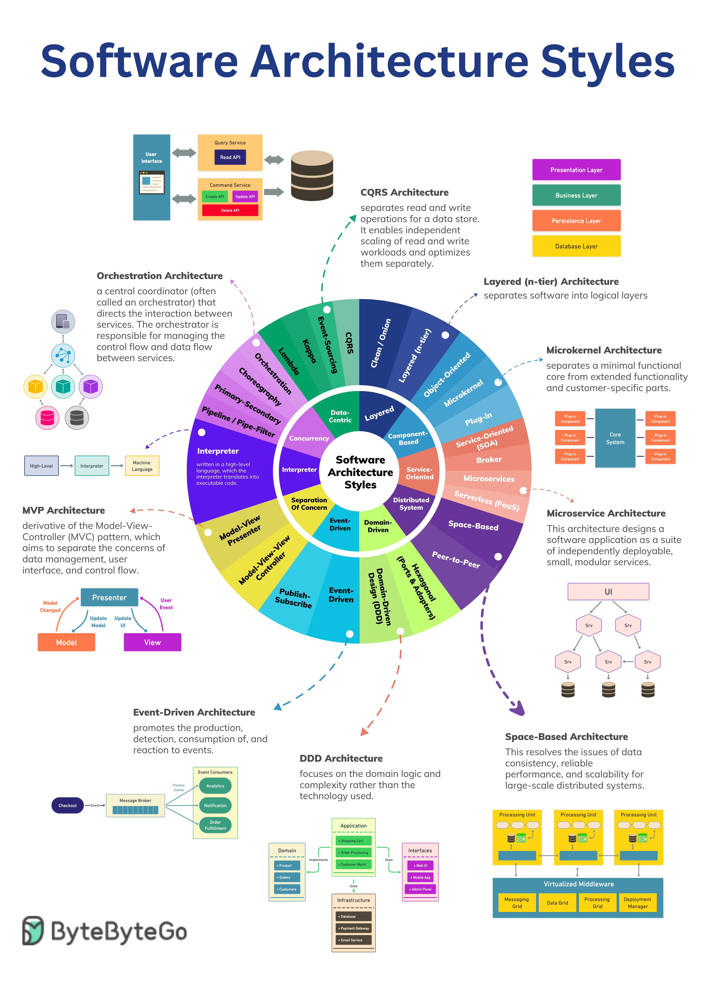

# 🏗️ 5大软件架构模式速查表！

> 架构选型的参考指南，一张图搞定

架构模式那么多，怎么选？这张速查表帮你快速了解每种模式的特点 👇

📌 架构模式是系统设计的蓝图，定义了组件如何交互来实现功能
📌 不同模式解决不同问题，选对了能节省大量时间
📌 这张速查表涵盖了最常用的架构风格和模式的核心特征

💡 没有万能的架构模式，关键是理解每种模式的适用场景和局限性。收藏这张图，选型时拿出来参考。

你最常用的架构模式是哪种？👇

---

#软件架构 #架构模式 #微服务 #系统设计 #后端 #面试 #程序员
