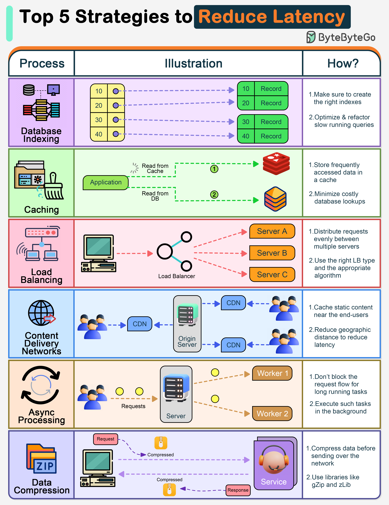

# ⏱️ 降低延迟的5大策略！每100ms延迟=1%销售额损失

> Amazon的教训：延迟就是钱

10年前 Amazon 发现每增加100ms延迟就损失1%销售额，换算到今天就是 **57亿美元** 👇

📌 **数据库索引** — 加速查询，减少全表扫描
📌 **缓存** — 热点数据存内存，避免每次查数据库
📌 **负载均衡** — 分散请求，避免单点过载
📌 **CDN** — 内容就近分发，减少网络传输距离
📌 **异步处理** — 耗时操作放后台，不阻塞主流程
📌 **数据压缩** — 减少传输数据量

💡 延迟优化是一个系统工程，先找到瓶颈再针对性优化，效果最好。

你的系统延迟优化做了哪些？👇

---

#延迟优化 #性能 #缓存 #CDN #系统设计 #后端 #面试
