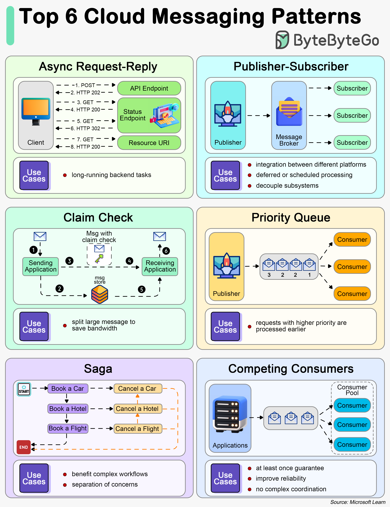

# ☁️ 6种云消息模式！服务间怎么通信？

> 异步请求、发布订阅、Saga……分布式通信必知

分布式系统中服务间怎么通信？6种常用消息模式 👇

📌 **异步请求-回复** — 前端发请求，后端返回202（已接受），异步处理后通知结果
📌 **发布-订阅** — 发送者和消费者解耦，发送者不用等待响应
📌 **Claim Check** — 大消息存数据库，只传引用，后续用引用取完整数据
📌 **优先级队列** — 高优先级请求优先处理
📌 **Saga** — 跨多个服务管理数据一致性，不依赖分布式事务
📌 **竞争消费者** — 多个消费者并发处理同一通道的消息，但不保证顺序

💡 Saga 模式是微服务架构中解决分布式事务的主流方案，面试高频考点。

你用过哪种消息模式？👇

---

#消息模式 #分布式 #Saga #微服务 #系统设计 #后端 #面试
