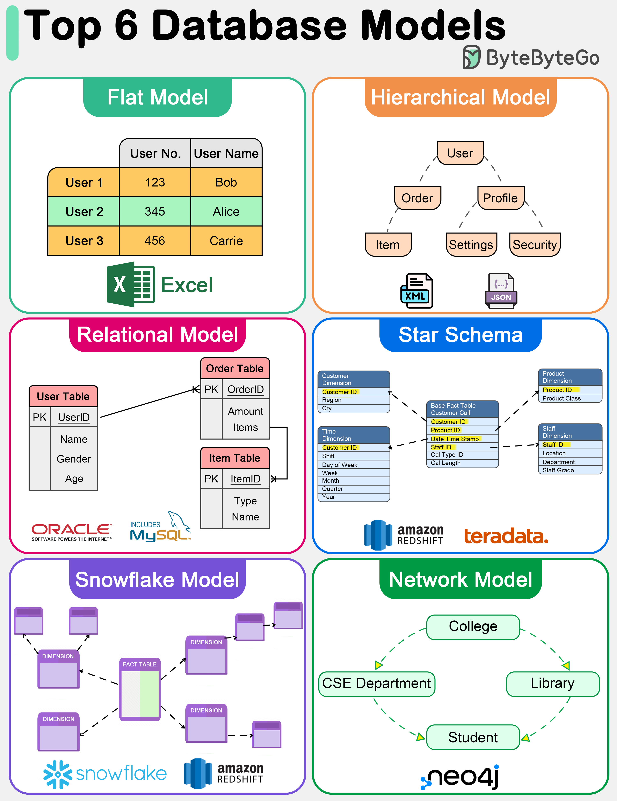

# 📊 6种数据库模型一图看懂！

> 扁平、层次、关系、星型、雪花、网状

数据库不只有关系型，6种数据模型各有特点 👇

📌 **扁平模型** — 像电子表格，单表存储，简单但无法处理复杂关系
📌 **层次模型** — 树形结构，一对多关系。高效但不擅长多对多
📌 **关系模型** — 表+行+列，SQL查询，最广泛使用。支持复杂查询和事务
📌 **星型模型** — 数据仓库专用，中心事实表+维度表，查询性能优
📌 **雪花模型** — 星型的变体，维度表做了规范化，减少冗余但查询更复杂
📌 **网状模型** — 图结构，支持多对多关系，克服了层次模型的局限

💡 OLTP 用关系模型，OLAP 用星型/雪花模型，图关系用网状模型。根据场景选。

你最熟悉哪种数据模型？👇

---

#数据库 #数据模型 #SQL #数据仓库 #系统设计 #后端 #面试
