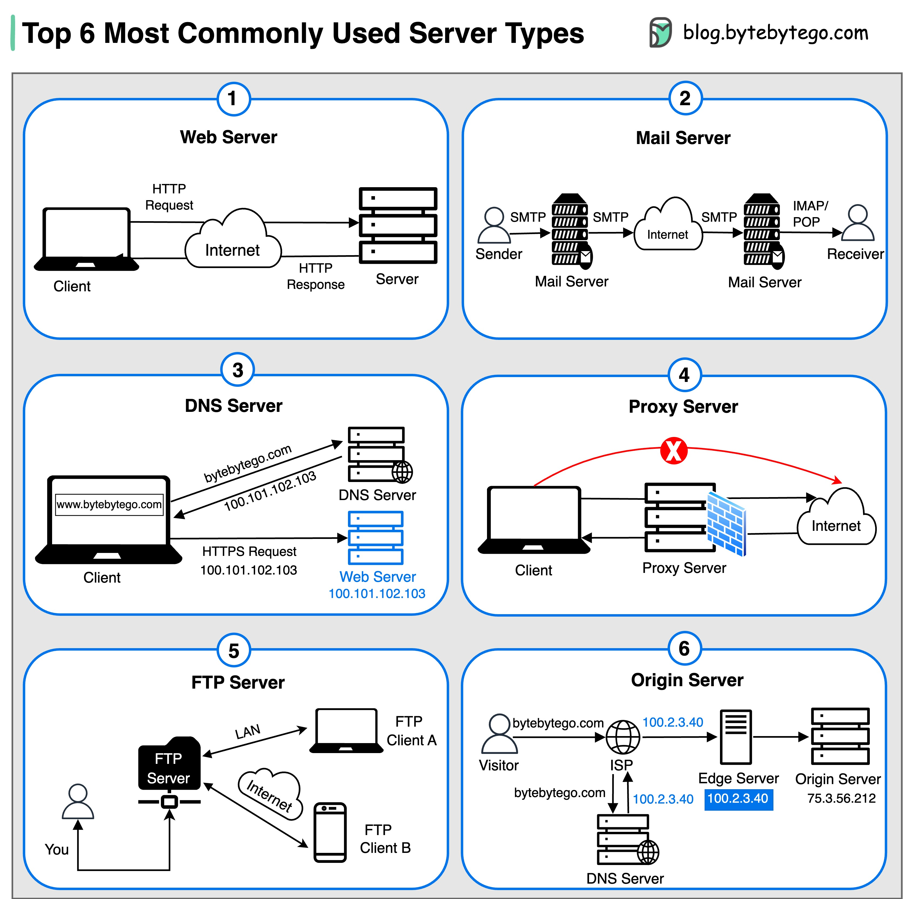

# 🖥️ 6种最常用的服务器类型！

> Web服务器、邮件服务器、DNS服务器……

服务器不只有Web服务器，6种最常用的类型 👇

📌 **Web Server** — 托管网站，通过互联网向客户端提供网页内容
📌 **Mail Server** — 处理邮件的发送、接收和路由
📌 **DNS Server** — 把域名翻译成IP地址
📌 **Proxy Server** — 客户端和服务器之间的中间人，提供安全、性能优化和匿名性
📌 **FTP Server** — 在客户端和服务器之间传输文件
📌 **Origin Server** — 托管源内容，缓存分发到边缘节点加速访问

💡 现代架构中这些服务器类型经常组合使用，比如 Nginx 既能当 Web Server 又能当 Proxy Server。

你最常打交道的是哪种服务器？👇

---

#服务器 #Web #DNS #代理 #后端 #网络 #程序员
