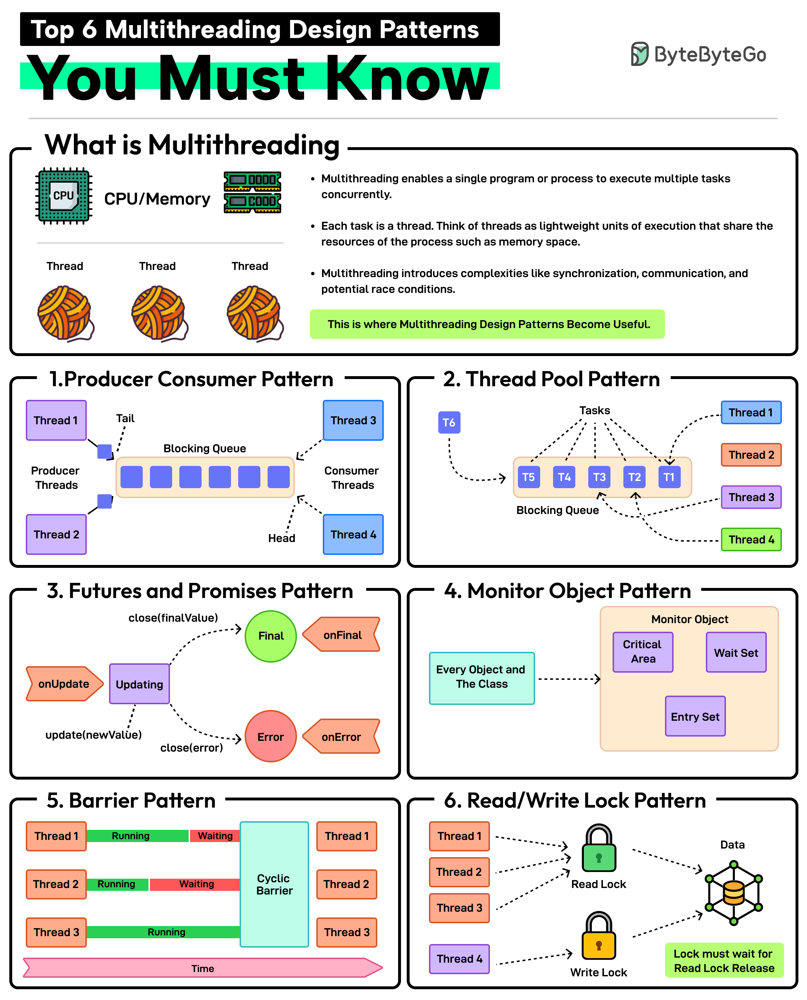

# 🧵 6种多线程设计模式！并发编程必知

> 生产者消费者、线程池、Future、读写锁……

多线程带来性能提升，也带来同步和竞态问题。这6种模式帮你搞定 👇

📌 **生产者-消费者** — 生产者生成数据，消费者处理数据，阻塞队列做缓冲
📌 **线程池** — 复用工作线程，避免频繁创建销毁的开销。适合大量短任务
📌 **Future/Promise** — Promise持有结果，Future提供访问方式。长任务不阻塞主线程
📌 **Monitor对象** — 确保同一时间只有一个线程访问共享资源，防止竞态条件
📌 **Barrier（屏障）** — 同步一组线程，所有线程到达屏障点后才继续下一阶段
📌 **读写锁** — 多线程可同时读，但写时独占。读多写少场景的最佳选择

💡 Java 的 ExecutorService 就是线程池模式，CompletableFuture 就是 Future/Promise 模式。

你最常用哪种并发模式？👇

---

#多线程 #并发 #设计模式 #Java #后端 #面试 #程序员
