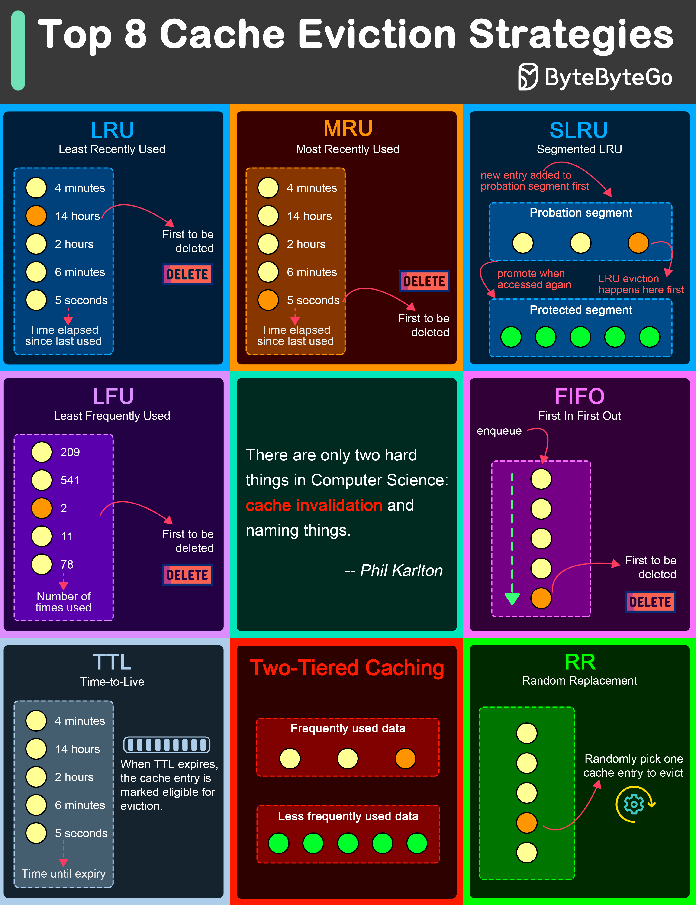

# 🗑️ 8种缓存淘汰策略全解析！

> LRU、LFU、FIFO、TTL、两级缓存……

缓存满了怎么办？8种淘汰策略各有适用场景 👇

📌 **LRU** — 淘汰最久没被访问的，最常用
📌 **MRU** — 淘汰最近刚访问的，特定场景有用
📌 **SLRU** — 分段LRU，试用区+保护区，防止热点数据被误淘汰
📌 **LFU** — 淘汰访问次数最少的
📌 **FIFO** — 先进先出，最简单
📌 **TTL** — 按过期时间淘汰
📌 **两级缓存** — 内存缓存+分布式缓存，两层保障
📌 **随机替换** — 随机淘汰，实现简单

💡 大多数场景用 LRU + TTL 组合就够了。选择策略前先分析你的数据访问模式。

你用过哪种淘汰策略？👇

---

#缓存 #LRU #Redis #性能优化 #系统设计 #后端 #面试
