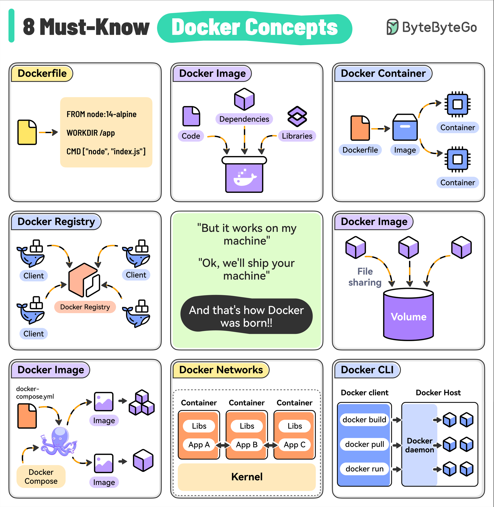

# 🐳 Docker必知的8个核心概念！

> Dockerfile、镜像、容器、仓库、卷、Compose……

用 Docker 之前，这8个概念必须搞清楚 👇

📌 **Dockerfile** — 构建镜像的指令文件，指定基础镜像、依赖和启动命令
📌 **Docker Image** — 轻量级独立包，包含运行应用所需的一切。可版本化
📌 **Docker Container** — 镜像的运行实例，相互隔离，安全可复现
📌 **Docker Registry** — 镜像仓库，Docker Hub 是默认公共仓库，也可搭私有仓库
📌 **Docker Volumes** — 持久化容器数据，可在多个容器间共享
📌 **Docker Compose** — 定义和运行多容器应用，一键管理整个技术栈
📌 **Docker Networks** — 容器间和主机间的网络通信，可自定义隔离或互通
📌 **Docker CLI** — 命令行工具，构建、运行、管理的主要交互方式

💡 先搞懂这8个概念，再上手实操，Docker 就不难了。

你最常用的 Docker 命令是什么？👇

---

#Docker #容器 #DevOps #云原生 #运维 #后端 #程序员
