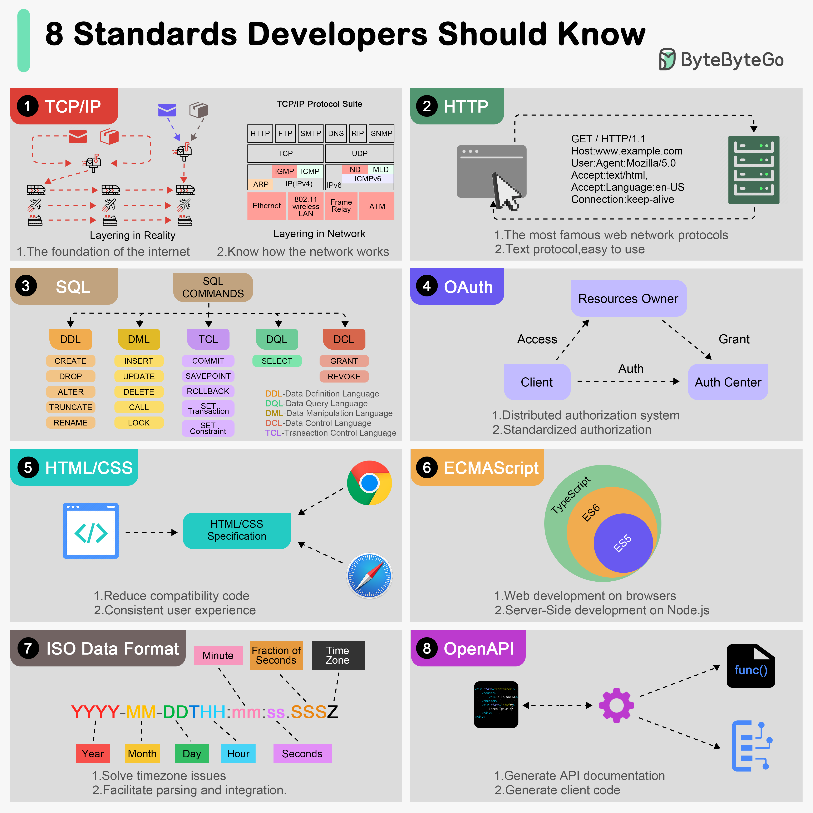

# 📐 开发者必知的8大技术标准！

> TCP/IP、HTTP、SQL、OAuth、HTML/CSS……

这8个标准是开发者的基础知识 👇

📌 **TCP/IP** — 互联网的基础，IETF制定
📌 **HTTP** — Web开发的核心协议
📌 **SQL** — 数据管理的领域特定语言
📌 **OAuth** — 开放授权标准，不暴露密码
📌 **HTML/CSS** — 网页渲染和样式的标准
📌 **ECMAScript** — JavaScript的标准化规范
📌 **ISO 8601** — 日期时间格式标准，解决跨时区跨文化的格式混乱
📌 **OpenAPI** — RESTful API的描述和文档标准

💡 这些标准让不同系统、不同团队能够无缝协作。了解标准背后的设计思想比死记规范更重要。

你觉得哪个标准对你影响最大？👇

---

#技术标准 #HTTP #SQL #OAuth #OpenAPI #程序员 #面试
