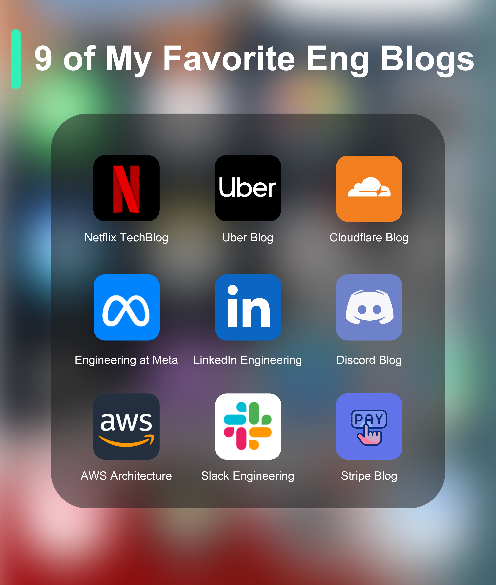

# 📝 9个顶级工程技术博客推荐！大厂都在分享什么

> Netflix、Uber、Meta、Stripe……一手技术干货

想了解大厂的技术实践？关注这9个工程博客 👇

📌 **Netflix TechBlog** — 流媒体架构、微服务、混沌工程
📌 **Uber Blog** — 出行平台的大规模系统设计
📌 **Cloudflare Blog** — 网络、安全、边缘计算
📌 **Engineering at Meta** — 社交平台的基础设施
📌 **LinkedIn Engineering** — 数据平台、搜索、推荐
📌 **Discord Blog** — 实时通信、消息存储
📌 **AWS Architecture** — 云架构最佳实践
📌 **Slack Engineering** — 协作工具的技术挑战
📌 **Stripe Blog** — 支付系统、API设计

💡 定期阅读这些博客，能让你了解真实的大规模系统是怎么设计和运维的。比看教科书更实用。

你还关注哪些技术博客？👇

---

#技术博客 #Netflix #Uber #Meta #程序员 #学习 #架构
