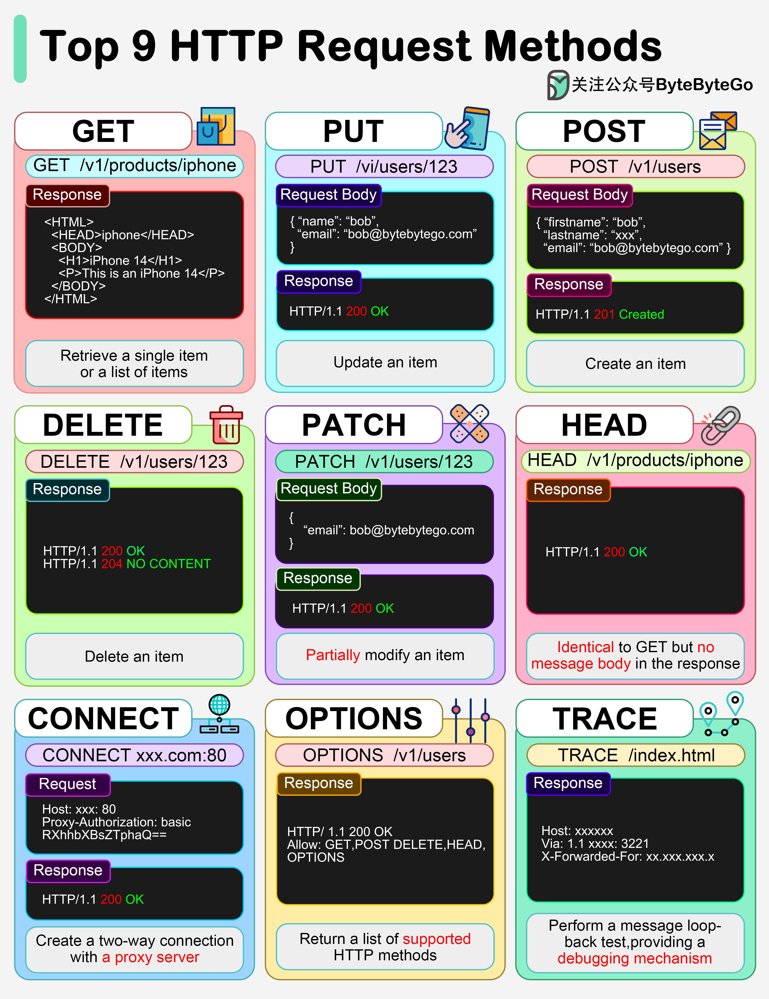

# 📮 9种HTTP请求方法一图搞定！

> GET、POST、PUT、DELETE……每个都要知道

HTTP 的9种"动词"，做API开发必须掌握 👇

📌 **GET** — 获取资源，幂等，多次请求结果相同
📌 **POST** — 创建资源，非幂等，两次POST会创建两个资源
📌 **PUT** — 更新或创建资源，幂等
📌 **DELETE** — 删除资源，幂等
📌 **PATCH** — 部分修改资源
📌 **HEAD** — 和GET一样但不返回响应体
📌 **CONNECT** — 建立到目标资源的隧道
📌 **OPTIONS** — 描述目标资源的通信选项（CORS预检请求用这个）
📌 **TRACE** — 沿路径执行消息回环测试

💡 日常开发最常用的就是 GET/POST/PUT/DELETE/PATCH 这5个。记住哪些是幂等的，面试加分。

你最常用哪几个？👇

---

#HTTP #API #RESTful #后端 #Web开发 #面试 #程序员
