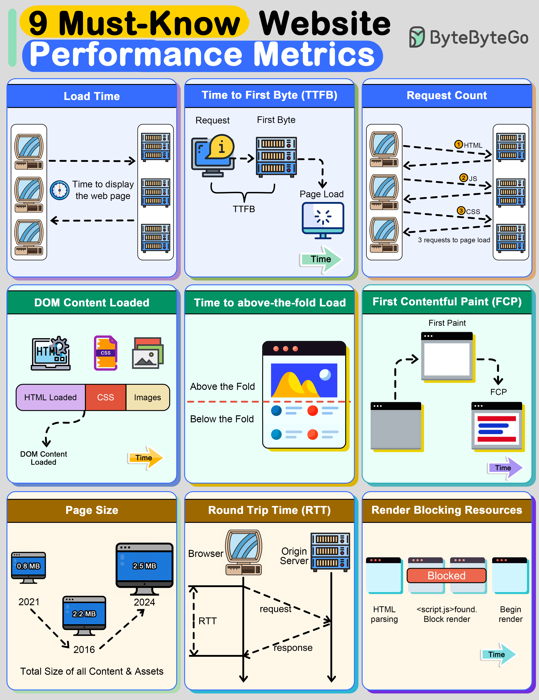

# 📊 9个网站性能指标！前端优化必看

> 加载时间、TTFB、FCP、RTT……每个都不能忽视

网站性能直接影响用户体验和转化率，这9个指标必须关注 👇

📌 **Load Time** — 页面完全加载时间
📌 **TTFB** — 首字节时间，反映服务器处理能力
📌 **Request Count** — HTTP请求数，越少越快
📌 **DCL** — HTML加载完成时间（不含CSS等资源）
📌 **Above-the-Fold** — 首屏加载时间，决定用户是否继续浏览
📌 **FCP** — 首次内容绘制，浏览器开始渲染的时间
📌 **Page Size** — 页面总大小，越大加载越慢
📌 **RTT** — 往返时间，请求到响应的耗时
📌 **Render Blocking** — 阻塞渲染的资源数量，越多延迟越大

💡 Google 的 Core Web Vitals 已经把性能指标纳入搜索排名因素。性能优化不只是体验问题，更是流量问题。

你最关注哪个性能指标？👇

---

#性能优化 #前端 #Web #TTFB #FCP #SEO #程序员
