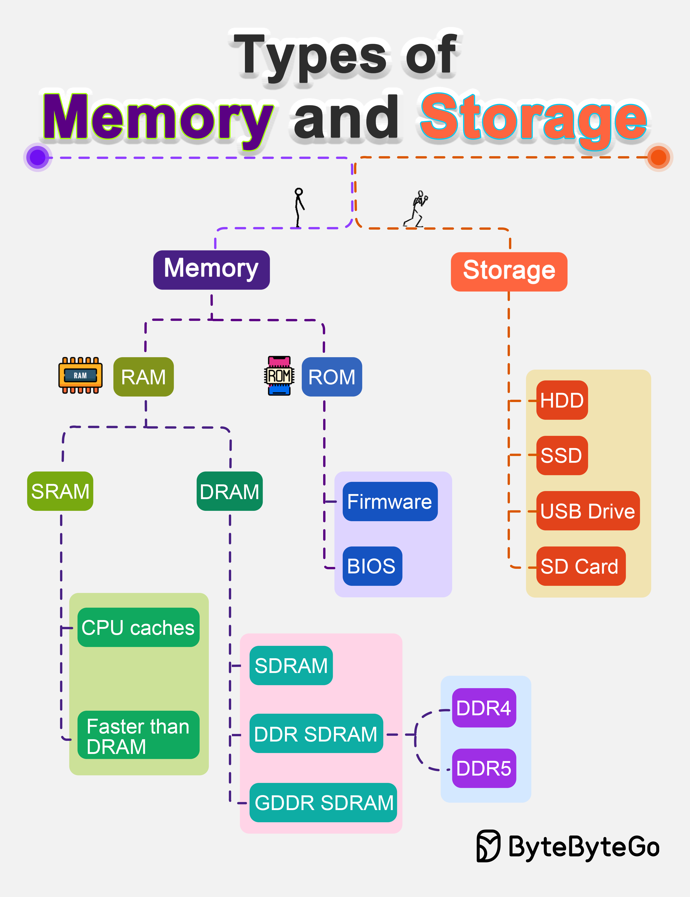

# 💾 计算机内存和存储类型大全！

> RAM、ROM、SSD、HDD……一张图全覆盖

计算机的内存和存储世界，比你想的丰富 👇

📌 **基础双雄** — RAM（随机存取）和 ROM（只读）
📌 **内存代际** — DDR4 和 DDR5
📌 **固件** — Firmware 和 BIOS
📌 **内存类型** — SRAM（快但贵）和 DRAM（慢但便宜）
📌 **存储设备** — HDD、SSD、USB Drive、SD Card

💡 简单记：越快的越贵越小，越便宜的越慢越大。系统设计就是在速度和成本之间找平衡。

你的电脑用的什么存储组合？👇

---

#内存 #存储 #SSD #HDD #RAM #计算机 #硬件
