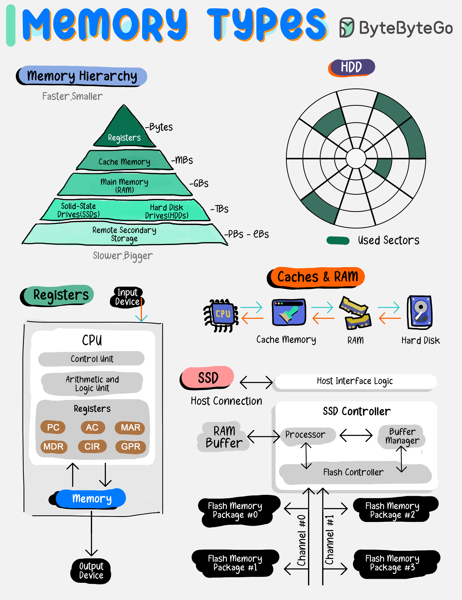

# 🧠 内存层次结构！从寄存器到远程存储

> 越快越小越贵，越慢越大越便宜

计算机内存是分层的，每层都有自己的角色 👇

📌 **寄存器（Registers）** — CPU内部，极小极快，存即时数据
📌 **缓存（Cache）** — 靠近CPU，加速数据读取（L1/L2/L3）
📌 **主存（RAM）** — 存放正在运行的程序和数据
📌 **SSD** — 无机械部件，快速可靠的持久化存储
📌 **HDD** — 机械硬盘，容量大，长期存储
📌 **远程存储** — 异地备份和归档，通过网络访问

💡 理解内存层次结构对系统设计至关重要——知道数据放在哪一层，就知道性能瓶颈在哪里。

你能说出 L1 Cache 和 RAM 的延迟差多少吗？👇

---

#内存 #计算机架构 #缓存 #SSD #系统设计 #后端 #面试
