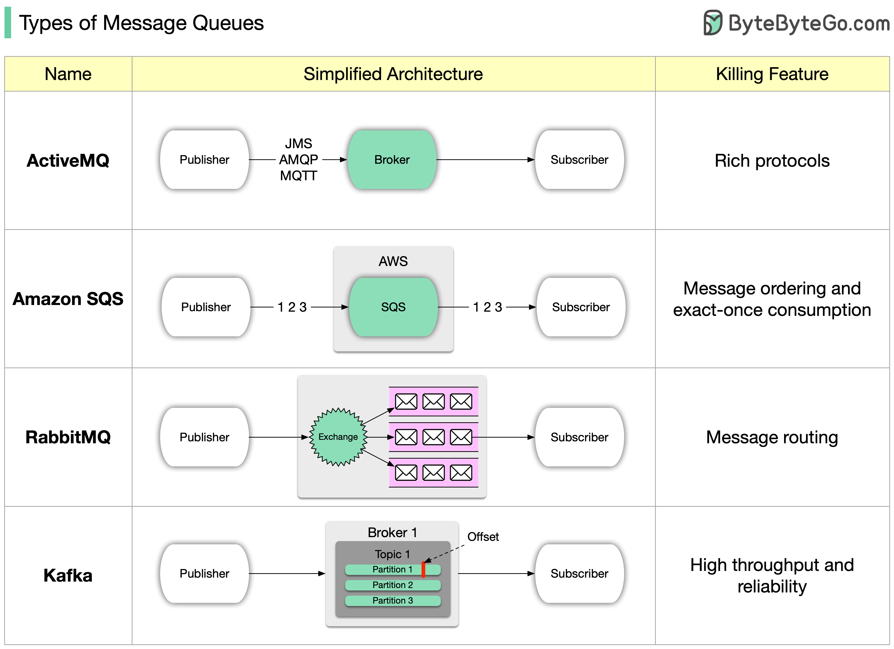

# 📬 消息队列有哪些？选型要看这7个维度

> Kafka、RabbitMQ、RocketMQ……怎么选？

消息队列就像数字邮局，帮程序之间有序通信。选型要看这几个维度 👇

📌 **速度** — 消息收发有多快
📌 **扩展性** — 消息量增长时能否扩展
📌 **可靠性** — 消息会不会丢
📌 **持久性** — 消息能否安全保存
📌 **易用性** — 搭建和管理是否简单
📌 **生态** — 有没有配套工具
📌 **协议支持** — 支持哪些通信协议

💡 入门建议：先从 Kafka 开始练手，发送和接收消息，熟悉了再深入学习其他消息队列。

你用过哪些消息队列？👇

---

#消息队列 #Kafka #RabbitMQ #后端 #分布式 #系统设计 #面试
