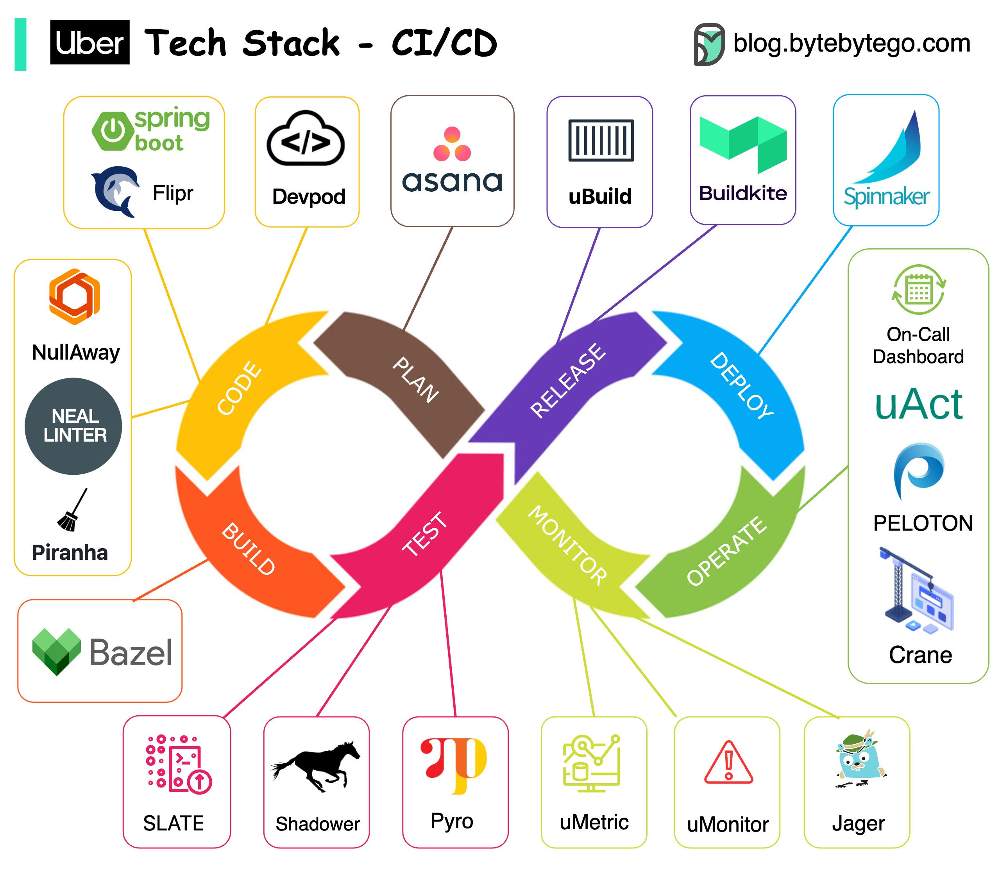

# 🚗 Uber的CI/CD技术栈！从规划到监控全链路

> 自研工具+开源方案的完美组合

Uber 是工程创新的标杆，来看看他们的 CI/CD 技术栈 👇

📌 **项目规划** — JIRA
📌 **后端服务** — Spring Boot + Flipr（自研配置系统，快速发布配置）
📌 **代码质量** — NullAway（解决空指针）、NEAL（代码检查）、Piranha（清理过期Feature Flag）
📌 **代码仓库** — Monorepo + Bazel 大规模构建
📌 **测试** — SLATE（短期测试环境）、Shadower（回放生产流量做负载测试）、Ballast（用户体验保障）
📌 **实验平台** — 基于深度学习，开源了 Pyro
📌 **构建** — uBuild（基于Buildkite的容器打包）
📌 **部署** — Netflix Spinnaker
📌 **监控** — uMetric（基于Cassandra）
📌 **特色工具** — Peloton（容量规划）、Crane（多云成本优化）

💡 Uber 的 CI/CD 特点：几乎每个环节都有自研工具，解决特定规模下的特定问题。

你们的 CI/CD 流程有多少自研工具？👇

---

#Uber #CICD #DevOps #Monorepo #Spinnaker #后端 #架构
