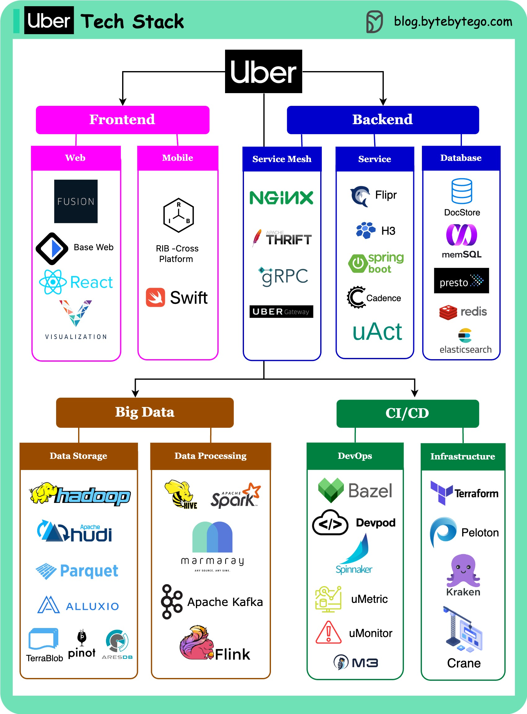

# 🚗 Uber技术栈全景图！从前端到大数据

> 全球最大出行平台的技术选型揭秘

Uber 的技术栈覆盖了从前端到大数据的每个环节 👇

📌 **Web前端** — Fusion.js（React框架）+ visualization.js（地理可视化）
📌 **移动端** — RIB跨平台框架 + VIPER架构，Swift/Java
📌 **服务网格** — Uber Gateway（基于Nginx）+ gRPC + QUIC + Thrift
📌 **后端服务** — Flipr配置中心、H3位置索引、Spring Boot、Cadence工作流编排
📌 **数据库** — DocStore（MySQL+PostgreSQL+RocksDB）
📌 **大数据** — Hadoop家族、Hudi、Parquet、Pinot、AresDB
📌 **数据处理** — Hive、Spark、Kafka、Flink
📌 **DevOps** — Monorepo、Spinnaker、uMetric、M3

💡 Uber 的特点：大量自研工具 + 开源回馈社区。H3、Cadence、Piranha 都是他们开源的。

你对 Uber 的哪个技术选型最感兴趣？👇

---

#Uber #技术栈 #架构 #微服务 #大数据 #后端 #系统设计
