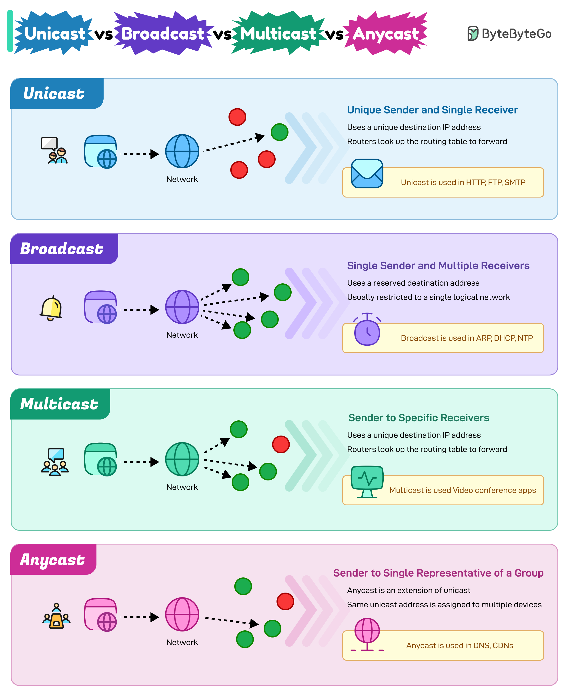

# 📡 单播、广播、组播、任播！4种网络通信方式

> 用派对的比喻秒懂网络通信

网络通信有4种基本方式，用派对来比喻 👇

📌 **Unicast（单播）**
一对一通信，像派对上两个人聊天
→ HTTP、FTP、SMTP

📌 **Broadcast（广播）**
一对所有，像站在台上对所有人喊话（但不保证每个人都听到）
→ ARP、DHCP、NTP

📌 **Multicast（组播）**
一对特定群组，像派对里一个小圈子的人互相交流
→ IPTV、视频会议

📌 **Anycast（任播）**
一对最近的一个，像对一群主办方中的任意一个说谢谢
→ DNS查询、CDN

💡 CDN 用的就是 Anycast，把用户请求路由到最近的节点。面试可能会问到。

你能说出这4种通信方式的区别吗？👇

---

#网络通信 #单播 #广播 #组播 #计算机网络 #面试 #后端
