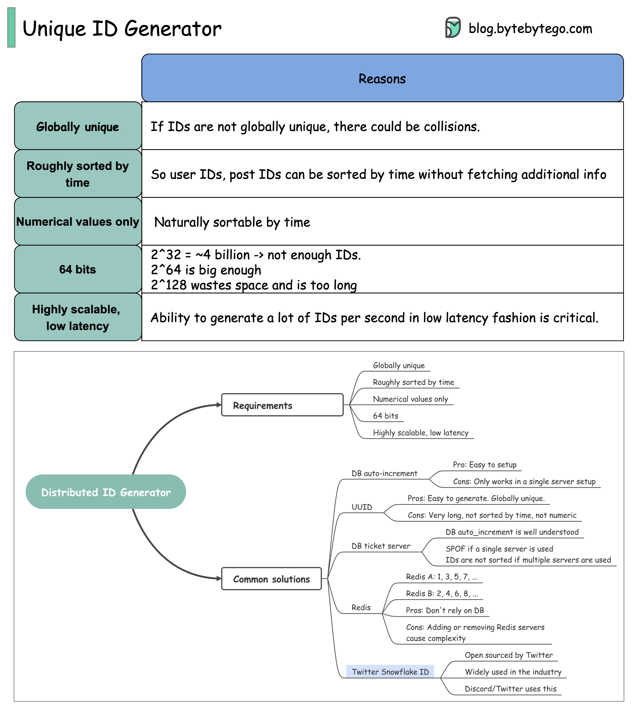

# 🆔 分布式唯一ID怎么生成？面试高频题

> 全局唯一、按时间排序、64位、高扩展

后端系统中ID至关重要，怎么生成全局唯一的ID？👇

📌 **核心要求：**
- 全局唯一
- 大致按时间排序
- 纯数字
- 64位
- 高扩展、低延迟

📌 **常见方案：**
- UUID — 简单但不排序、太长
- 数据库自增 — 简单但有单点瓶颈
- Snowflake — Twitter方案，时间戳+机器ID+序列号
- 号段模式 — 批量获取ID段，减少数据库访问

💡 Snowflake 是最经典的分布式ID方案，面试系统设计题经常考。理解它的位分配策略是关键。

你的项目用的什么ID生成方案？👇

---

#分布式ID #Snowflake #系统设计 #后端 #面试 #架构 #程序员
