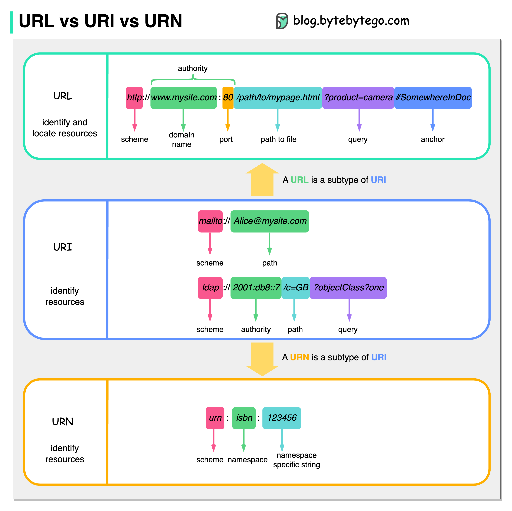

# 🔗 URL、URI、URN 到底有什么区别？

> 很多人分不清，一张图搞定

这三个概念经常被混淆，其实关系很简单 👇

📌 **URI（统一资源标识符）**
标识Web上的逻辑或物理资源。URL和URN都是URI的子类型
格式：`scheme:[//authority]path[?query][#fragment]`

📌 **URL（统一资源定位符）**
HTTP的核心概念，Web上唯一资源的地址。也可用于FTP、JDBC等协议
→ URL = 定位资源（在哪里）

📌 **URN（统一资源名称）**
使用 `urn:` 方案，不能用来定位资源
→ URN = 命名资源（叫什么）

💡 简单记：URI 是总称，URL 告诉你"在哪"，URN 告诉你"叫什么"。日常开发中说的"URL"其实大多数时候指的是URI。

你能举出一个URN的例子吗？👇

---

#URL #URI #URN #Web #HTTP #面试 #程序员
