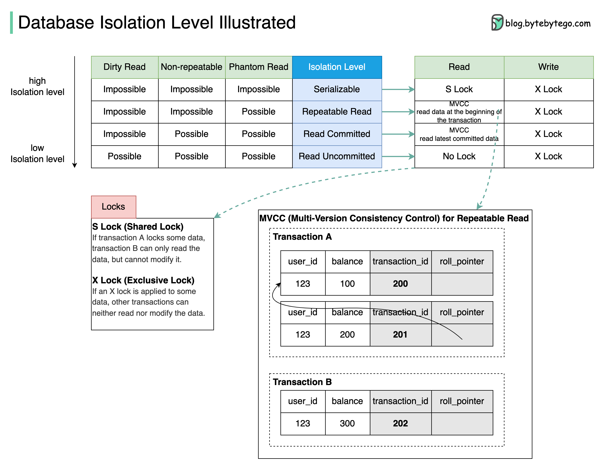

# 🔒 数据库4种隔离级别详解！MVCC是怎么工作的？

> 串行化、可重复读、读已提交、读未提交

数据库隔离级别决定了并发事务之间的可见性 👇

📌 **Serializable（串行化）** — 最高级别，事务保证按顺序执行
📌 **Repeatable Read（可重复读）** — 事务开始后读到的数据始终一致
📌 **Read Committed（读已提交）** — 只能读到已提交的数据修改
📌 **Read Uncommitted（读未提交）** — 可以读到未提交的数据（脏读）

📌 **MVCC 怎么工作的？**
以可重复读为例：
- 每行有隐藏列：transaction_id 和 roll_pointer
- 事务A开始时创建 Read View（transaction_id=201）
- 事务B开始时创建 Read View（transaction_id=202）
- 事务A修改数据后，事务B仍然读到自己 Read View 创建时的数据

💡 MySQL 默认隔离级别是 Repeatable Read，PostgreSQL 默认是 Read Committed。面试高频考点。

你能说出每种级别会出现什么问题吗？👇

---

#数据库 #隔离级别 #MVCC #事务 #MySQL #后端 #面试
