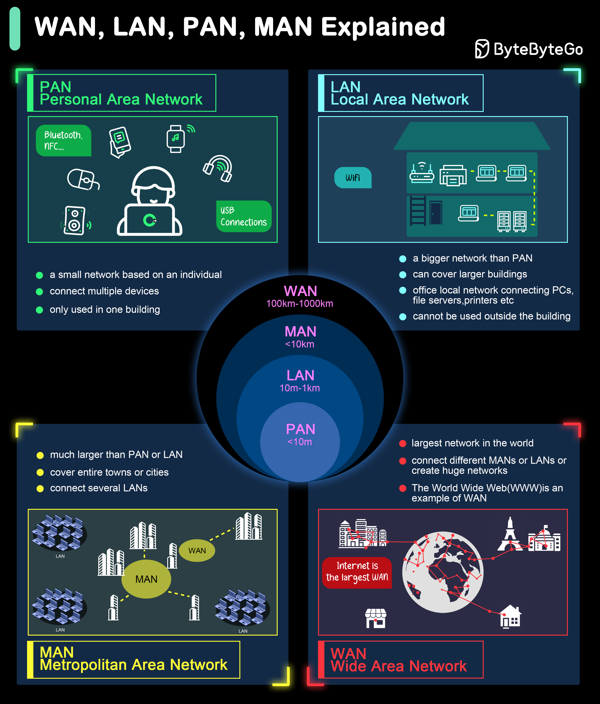

# 🌐 WAN、LAN、PAN、MAN有什么区别？4种网络类型

> 从个人到全球，网络按范围分4种

网络按覆盖范围分4种 👇

📌 **PAN（个人区域网）** — 几米范围，蓝牙耳机、手机和手表之间的连接
📌 **LAN（局域网）** — 家庭/办公室/建筑内，共享打印机、文件服务器
📌 **MAN（城域网）** — 覆盖一个城市，连接大学多个校区、城市政府办公室
📌 **WAN（广域网）** — 覆盖国家/大洲，互联网就是最大的WAN

💡 范围从小到大：PAN < LAN < MAN < WAN。面试基础题，但很多人分不清MAN和WAN。

你能举出每种网络的实际例子吗？👇

---

#网络 #LAN #WAN #计算机网络 #面试 #程序员 #基础
