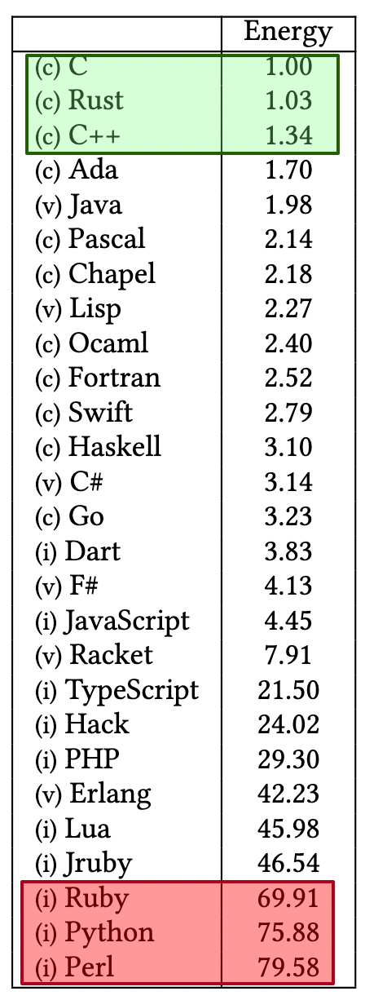

# 🌱 最节能的编程语言是哪个？28种语言能耗对比

> C最省电，Python最费电？研究结果可能让你意外

一项研究用10个基准问题测试了28种编程语言的运行时间、内存使用和能耗 👇

📌 **研究发现：**
- 更慢的语言不一定更费电
- 内存使用也会影响能耗
- 编译型语言通常比解释型语言更节能

💡 当能效成为关注点时（比如大规模数据中心、IoT设备），编程语言的选择也是一个重要因素。

你觉得哪种语言最节能？👇

---

#编程语言 #节能 #绿色计算 #C #Python #程序员 #技术
