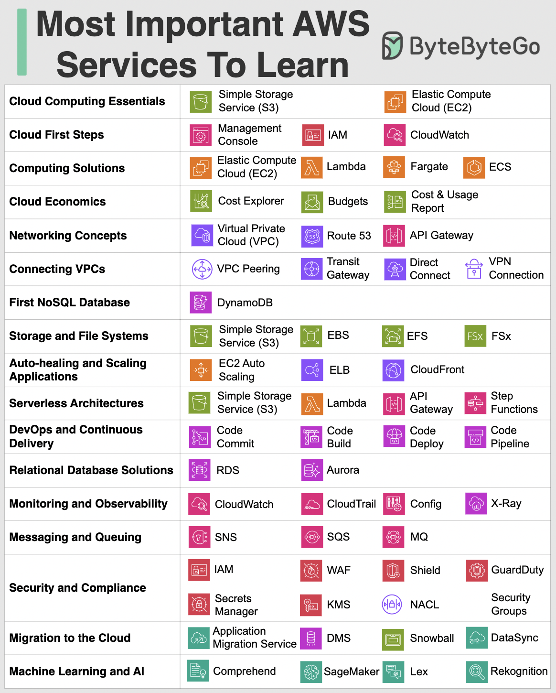

# ☁️ 最重要的AWS服务有哪些？学习路线图

> 200+服务太多了，从这些核心服务开始

AWS 有200多个服务，从哪开始学？这张图帮你理清重点 👇

📌 从2006年的S3和EC2起步，AWS已经发展成覆盖计算、存储、网络、数据库、分析、机器学习的庞大生态

📌 这张图既是入门起点，也是快速参考指南，涵盖了云计算基础服务和高级服务（Serverless、DevOps、ML）

💡 不用全学，先掌握核心服务（EC2、S3、RDS、Lambda、VPC），再根据业务需求扩展。

你最常用的AWS服务是哪个？👇

---

#AWS #云计算 #EC2 #S3 #Lambda #后端 #架构
