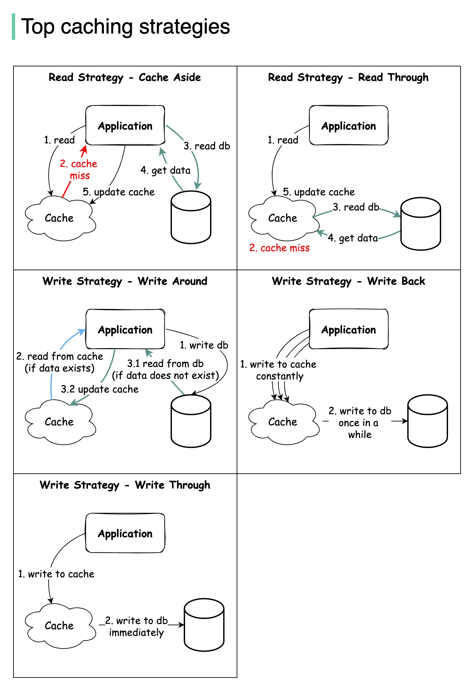

# 💾 5大缓存策略图解！读写分开看更清晰

> Cache Aside、Read Through、Write Through……

缓存策略分读和写两类 👇

📌 **读策略：**
- **Cache Aside** — 先查缓存，没有再查DB并回填
- **Read Through** — 缓存层自动从DB加载

📌 **写策略：**
- **Write Around** — 直接写DB，绕过缓存
- **Write Back** — 先写缓存，异步写DB
- **Write Through** — 同时写缓存和DB

💡 这些策略可以组合使用，比如 Cache Aside + Write Around 是最常见的组合。

你的项目用的哪种组合？👇

---

#缓存 #缓存策略 #Redis #性能优化 #系统设计 #后端 #面试
