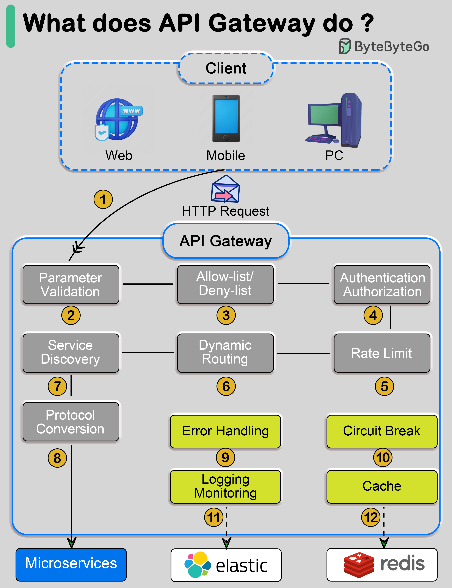

# 🚪 API网关到底做了什么？12步完整流程

> 解析、验证、认证、限流、路由、转换、熔断、日志……

一个请求经过API网关时，发生了什么？👇

📌 **Step 1** — 客户端发送HTTP请求
📌 **Step 2** — 解析和验证请求属性
📌 **Step 3** — 白名单/黑名单检查
📌 **Step 4** — 身份认证和授权（对接身份提供者）
📌 **Step 5** — 限流检查，超限则拒绝
📌 **Step 6-7** — 路径匹配，找到目标微服务
📌 **Step 8** — 协议转换，发送到后端微服务
📌 **Step 9-12** — 错误处理、熔断、ELK日志监控、数据缓存

💡 API网关是微服务架构的守门人，把认证、限流、监控等横切关注点从业务服务中抽离出来。

你们的API网关用的什么？Kong？Nginx？自研？👇

---

#API网关 #微服务 #限流 #熔断 #架构 #后端 #面试
