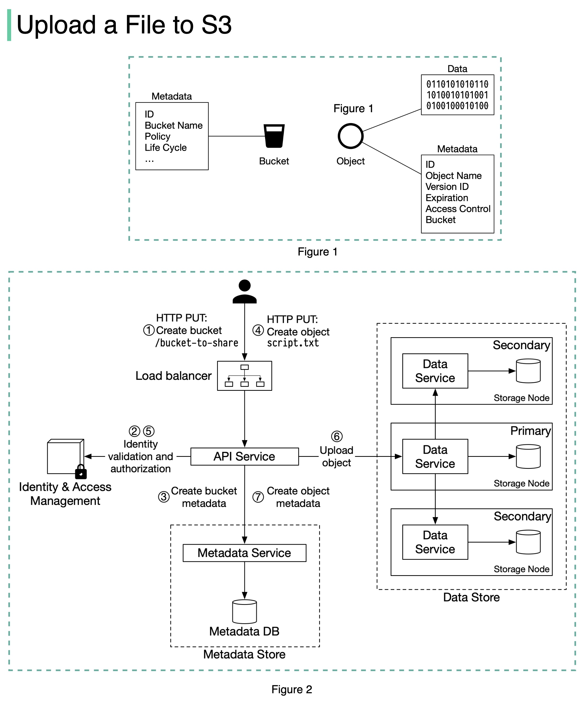

# 📦 上传文件到S3时发生了什么？完整流程揭秘

> Bucket、Object、元数据、权限验证……

S3 上传文件的完整流程 👇

📌 **核心概念：**
- **Bucket** — 对象的逻辑容器，名称全局唯一
- **Object** — 包含元数据（可变）和对象数据（不可变）

📌 **创建Bucket：**
1. 客户端发送PUT请求创建Bucket
2. API服务调用IAM验证权限
3. 元数据存储创建Bucket条目

📌 **上传Object：**
4. 客户端发送PUT请求上传文件
5. API服务验证身份和写权限
6. 数据存储持久化对象，返回UUID
7. 元数据存储创建对象条目（object_id、bucket_id、object_name等）

💡 S3 的设计把元数据和对象数据分开存储，这是它能做到高可用和高扩展的关键。

你用S3存过什么类型的数据？👇

---

#S3 #AWS #对象存储 #云存储 #系统设计 #后端 #架构
