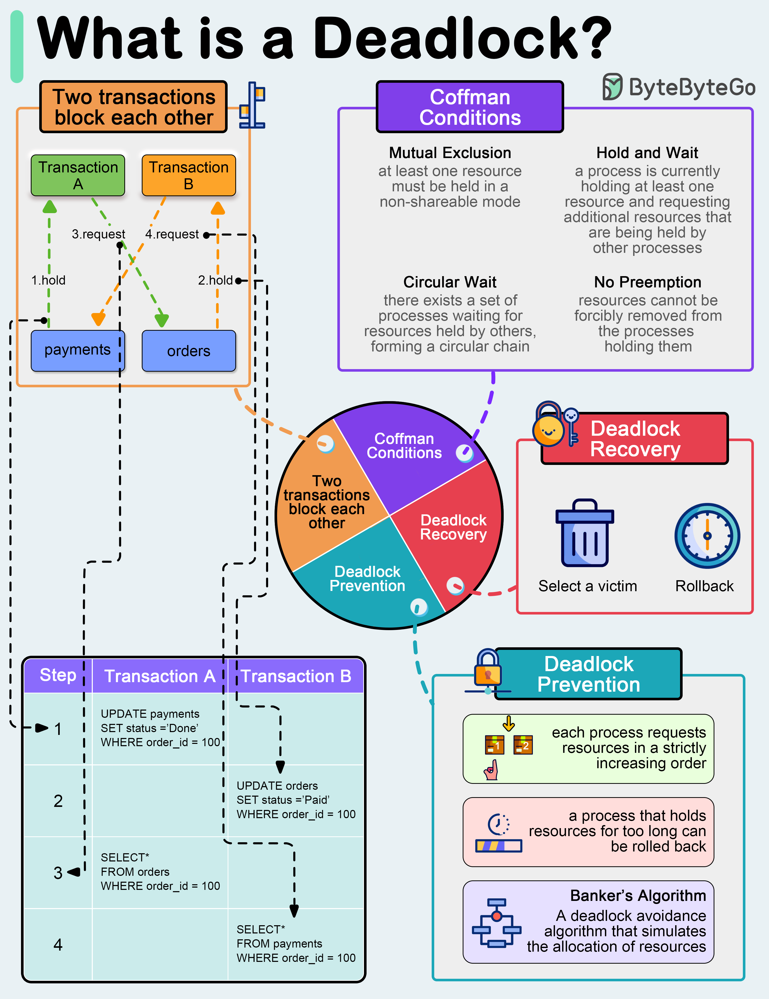

# 💀 什么是死锁？4个条件+预防+恢复

> 两个事务互相等对方释放锁，谁也动不了

死锁：两个或多个事务互相等待对方释放锁，导致都无法继续 👇

📌 **Coffman四条件（同时满足才会死锁）：**
- 互斥 — 资源不能共享
- 持有并等待 — 持有资源的同时等待其他资源
- 不可抢占 — 不能强制释放别人的锁
- 循环等待 — 形成等待环

📌 **预防：**
- 资源排序 — 按固定顺序请求资源
- 超时机制 — 持有资源太久就回滚
- 银行家算法 — 模拟分配，避免不安全状态

📌 **恢复：**
- 选择牺牲者 — 根据资源使用、优先级、回滚成本选择
- 回滚 — 回滚整个事务或部分，自动重启

💡 大多数数据库都有死锁检测机制，会自动选择一个事务回滚。但预防比恢复更重要。

你遇到过死锁吗？👇

---

#死锁 #并发 #数据库 #操作系统 #面试 #后端 #程序员
