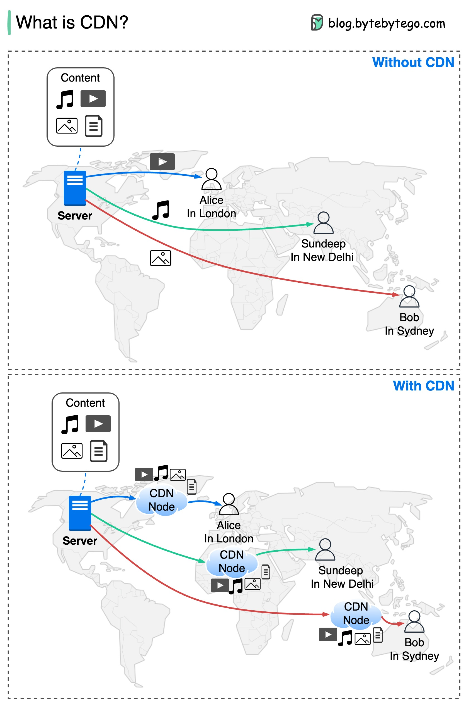

# 🚀 CDN到底是什么？为什么网站加载能这么快？

> 一张图搞懂CDN内容分发网络的工作原理

你有没有想过，为什么刷视频、看图片那么快？答案就是 **CDN** 👇

📌 **CDN是什么？**
- CDN = **Content Delivery Network**（内容分发网络）
- 本质就是在全球各地部署的**边缘服务器**
- 用户不用跑到源站取内容，直接从**最近的CDN节点**获取

🎯 **CDN的工作原理：**
- 把音乐、视频、图片等**静态和动态内容**缓存到全球节点
- 用户请求时，自动路由到**距离最近**的服务器
- 大大减少了数据传输的距离和时间

💡 **CDN的四大好处：**
1️⃣ **降低延迟** — 内容离用户更近，加载更快
2️⃣ **减少带宽** — 源站压力大幅降低
3️⃣ **提升安全性** — 有效防御 **DDoS攻击**
4️⃣ **提高可用性** — 即使部分节点故障，其他节点照常服务

简单说，CDN就像是在你家门口开了个"快递驿站"，不用每次都从总仓发货了 📦

你用过哪些CDN服务？Cloudflare还是AWS CloudFront？👇

---

#CDN #内容分发 #网络加速 #后端 #系统设计 #网站优化 #DDoS防护
