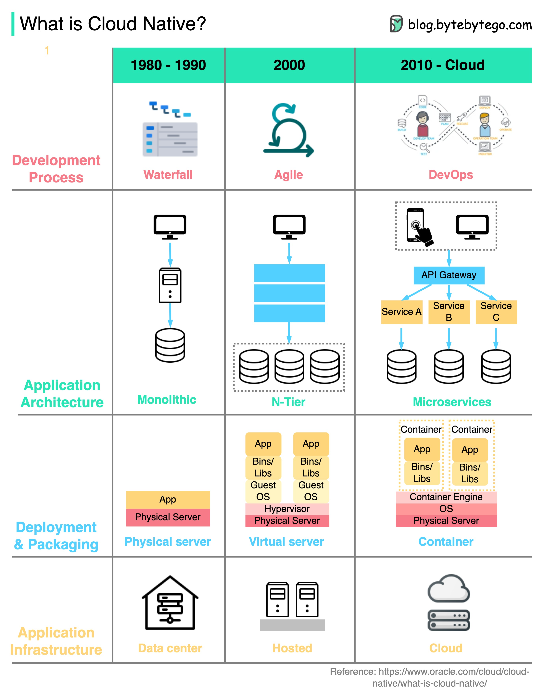

# ☁️ 什么是云原生？一张图看懂40年技术演进！

> 从物理机到容器化，云原生改变了我们构建应用的方式

"云原生"这个词天天听，到底是什么意思？👇

📌 **云原生的核心思想：**
- 应用从设计之初就**为云环境而生**
- 充分利用云的弹性，**自动伸缩**、**高可用**
- 可以跑在公有云、私有云、混合云上

🔄 **云原生的四大维度：**

1️⃣ **开发流程**
- 从瀑布式 → 敏捷开发 → **DevOps**
- 迭代越来越快，交付越来越频繁

2️⃣ **应用架构**
- 从单体架构 → **微服务架构**
- 每个服务小而精，适配云容器的资源限制

3️⃣ **部署与打包**
- 物理机 → 虚拟机 → **Docker容器**
- 应用打包成镜像，随处部署

4️⃣ **基础设施**
- 自建机房 → **云基础设施**大规模部署
- 弹性扩缩容，按需付费

💡 云原生不是某一个技术，而是一整套**理念和实践**的组合。掌握它，就掌握了现代应用开发的核心。

你们公司已经上云原生了吗？遇到过什么坑？👇

---

#云原生 #CloudNative #Docker #微服务 #DevOps #架构 #后端开发
