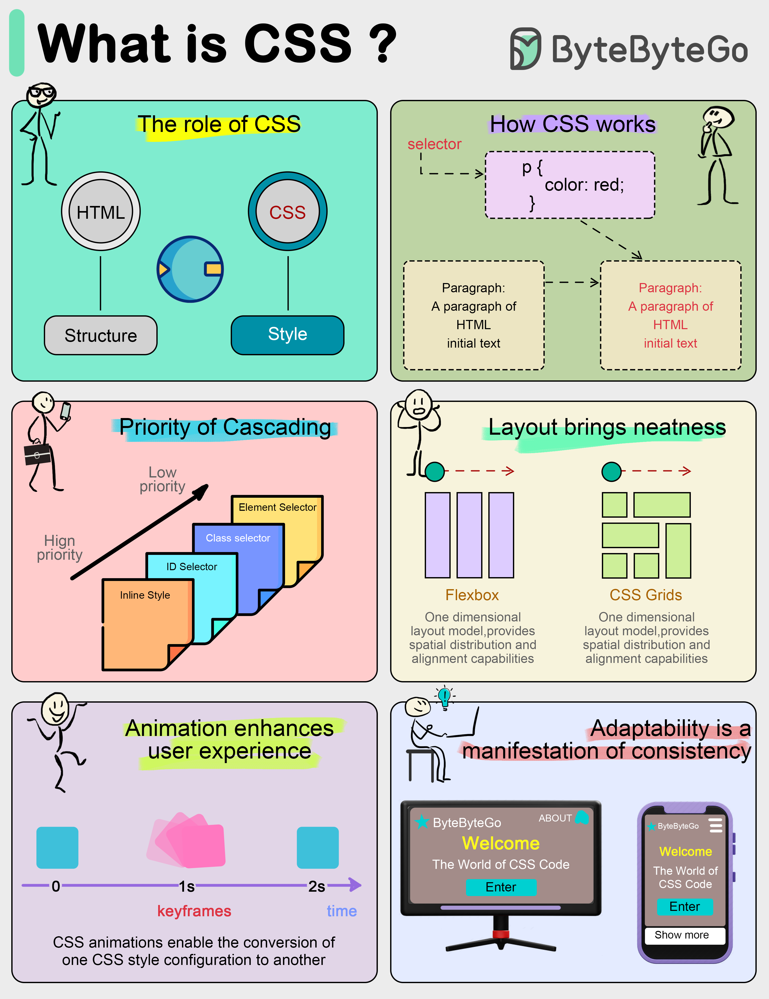

# 🎨 CSS到底是什么？前端必懂的样式语言全解析！

> 没有CSS的网页就像素颜出门，有了CSS才是精致妆容

前端开发不只是把内容展示出来，还得**好看**！CSS就是干这个的 👇

📌 **CSS是什么？**
- CSS = **Cascading Style Sheets**（层叠样式表）
- 把网页的**内容（HTML）** 和 **样式（CSS）** 分离
- 想换配色？改CSS文件就行，不用动HTML

🎯 **CSS怎么工作的？**
- 由**选择器** + **属性**组成
- 比如 `p { color: blue; }` → 所有段落文字变蓝
- **选择器**定位元素，**属性**描述样式

🔥 **CSS的核心概念：**

1️⃣ **层叠（Cascading）**
- 多条样式规则冲突时，浏览器按**优先级**决定用哪个
- 权重由选择器类型、来源顺序等决定

2️⃣ **强大的布局能力**
- **Flexbox** 和 **Grid** 两大布局神器
- 轻松实现响应式设计，告别复杂的浮动布局

3️⃣ **CSS动画**
- CSS3引入了 **@keyframes** 和 **transition**
- 不用JavaScript也能做出炫酷动画效果

4️⃣ **响应式设计**
- 一套CSS适配手机、平板、电脑
- 不同屏幕尺寸自动调整布局

💡 CSS从简单的改颜色改字体，已经进化成了前端开发的核心工具。学好CSS，页面颜值直接拉满！

你觉得CSS最难的部分是什么？居中对齐还是浮动？😂👇

---

#CSS #前端开发 #网页设计 #Flexbox #Grid #响应式设计 #Web开发
