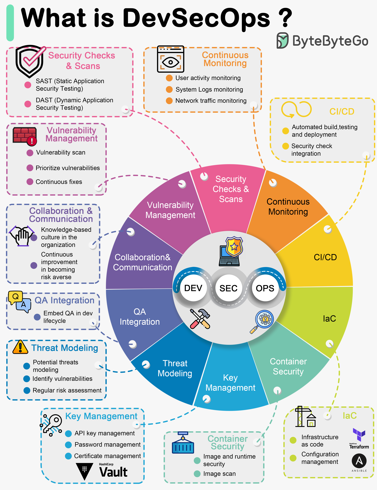

# 🔐 DevSecOps是什么？安全不再是事后补救！

> 把安全融入开发全流程，从源头杜绝漏洞

还在上线前才想起来做安全检查？那你需要了解 **DevSecOps** 👇

📌 **DevSecOps是什么？**
- **Dev**（开发）+ **Sec**（安全）+ **Ops**（运维）
- 是DevOps的自然进化，把**安全左移**到开发全生命周期
- 安全不再是最后一步，而是**每一步都有**

🔑 **DevSecOps的十大核心概念：**

1️⃣ **自动化安全检查** — 代码提交自动扫描漏洞
2️⃣ **持续监控** — 实时发现安全威胁
3️⃣ **CI/CD自动化** — 安全测试集成到流水线
4️⃣ **基础设施即代码（IaC）** — 安全配置版本化管理
5️⃣ **容器安全** — 镜像扫描、运行时防护
6️⃣ **密钥管理** — 敏感信息不再硬编码
7️⃣ **威胁建模** — 提前识别潜在攻击面
8️⃣ **QA集成** — 安全测试融入质量保证
9️⃣ **协作沟通** — 开发、安全、运维团队紧密配合
🔟 **漏洞管理** — 发现、跟踪、修复形成闭环

💡 DevSecOps的核心理念：**安全是每个人的责任**，不只是安全团队的事。越早发现问题，修复成本越低！

你们团队的安全实践做到了哪一步？👇

---

#DevSecOps #安全 #DevOps #CICD #容器安全 #后端 #运维
