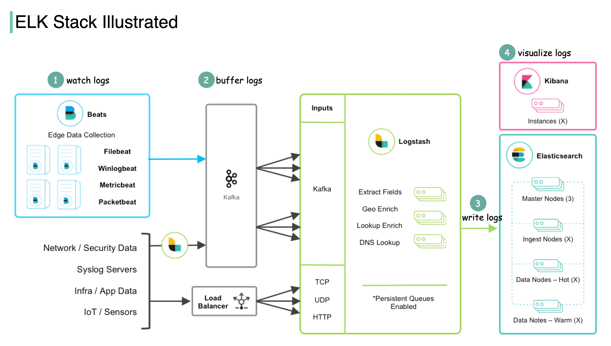

# 📊 ELK Stack是什么？为什么日志管理都用它？

> Elasticsearch + Logstash + Kibana，日志分析三剑客

线上出了Bug怎么排查？日志！日志怎么管理？**ELK Stack** 👇

📌 **ELK是什么？**
- **E** = **Elasticsearch** — 全文搜索和分析引擎，基于Apache Lucene
- **L** = **Logstash** — 数据收集、转换、传输管道
- **K** = **Kibana** — 数据可视化和分析面板

🔄 **ELK的工作流程：**

1️⃣ **Beats采集数据**
- **Filebeat** 收集日志文件
- **Winlogbeat** 收集Windows日志
- **Packetbeat** 抓取网络流量
- 轻量级Agent，部署在各个边缘节点

2️⃣ **Logstash聚合转换**
- 接收Beats发来的数据
- 数据量大时可以加 **Kafka** 做消息队列解耦
- 清洗、转换、格式化数据

3️⃣ **Elasticsearch存储索引**
- 数据写入ES进行索引和存储
- 支持海量数据的快速全文检索

4️⃣ **Kibana可视化展示**
- 提供丰富的搜索工具和仪表盘
- 图表、报表一目了然

💡 ELK之所以这么火，是因为它用**简单且强大的套件**解决了日志分析的痛点，而且性价比超高！

你们公司用的是ELK还是其他日志方案？👇

---

#ELK #Elasticsearch #日志管理 #Kibana #Logstash #后端 #运维 #监控
