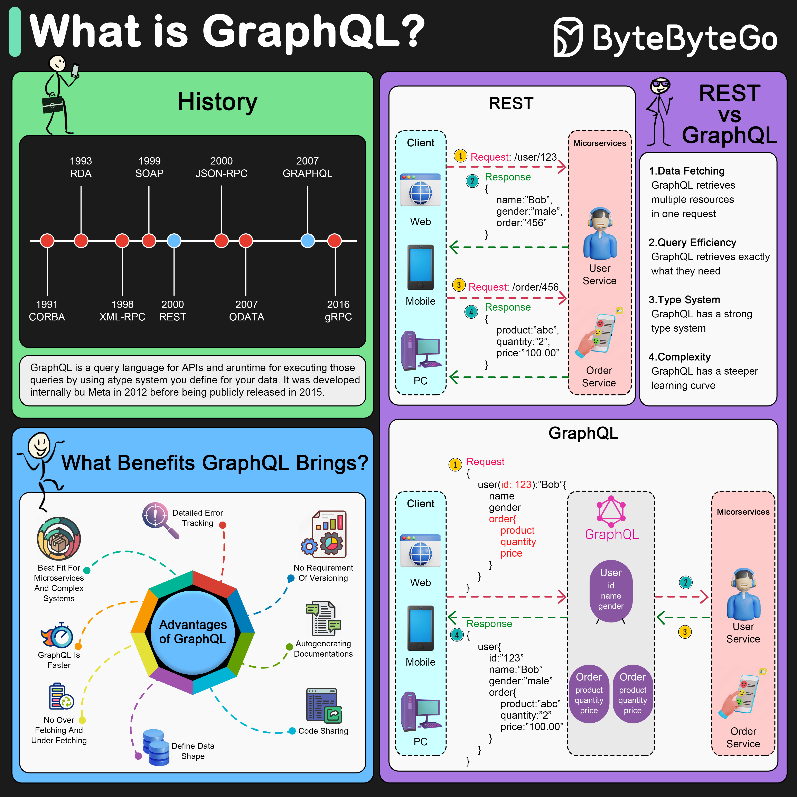

# 🔮 GraphQL是什么？能替代REST API吗？

> 想要什么数据就查什么，告别过度获取

还在为REST API返回一堆用不到的字段烦恼？来看看 **GraphQL** 👇

📌 **GraphQL是什么？**
- 一种**API查询语言**，由Meta（Facebook）在2012年内部开发，2015年开源
- 客户端可以**精确请求**需要的数据
- 一次查询就能从**多个数据源**获取数据

🎯 **GraphQL怎么工作的？**
- GraphQL服务器位于客户端和后端服务之间
- 可以把多个REST请求**聚合成一次查询**
- 资源以**图（Graph）** 的形式组织

🔥 **三种操作类型：**
- **Query** — 查询数据
- **Mutation** — 修改数据
- **Subscription** — 订阅数据变更，实时推送

✅ **GraphQL的优势：**
- 📦 数据获取更**高效**，要什么拿什么
- 🎯 返回结果更**精确**，没有冗余字段
- 🔒 **强类型系统**管理数据结构，减少错误
- 🏗️ 适合管理**复杂微服务**架构

⚠️ **GraphQL的不足：**
- 增加了系统**复杂度**
- 设计上可能导致**过度获取**
- **缓存**实现比REST更复杂

💡 GraphQL不是REST的替代品，而是另一种选择。适合数据关系复杂、前端需求多变的场景。

你们项目用的是GraphQL还是REST？👇

---

#GraphQL #API #REST #后端开发 #微服务 #系统设计 #前端
