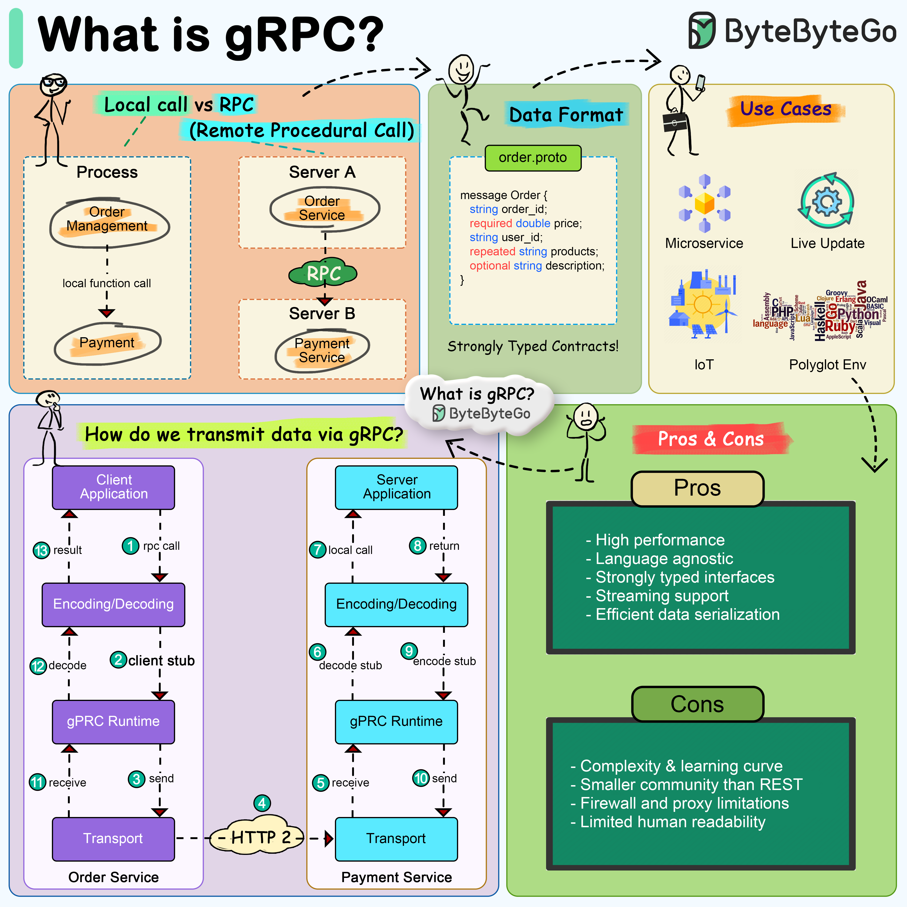

# ⚡ gRPC是什么？Google出品的高性能RPC框架！

> 比REST更快、更小、更强的微服务通信方案

微服务之间怎么高效通信？Google说：用 **gRPC** 👇

📌 **gRPC是什么？**
- Google开发的**高性能开源RPC框架**
- RPC = Remote Procedure Call（远程过程调用）
- 让调用远程服务就像调用本地函数一样简单

🔑 **gRPC的四大核心特性：**

1️⃣ **Protocol Buffers（Protobuf）**
- 默认使用Protobuf作为**接口定义语言（IDL）**
- 消息体比JSON和XML**更小更快**
- 用 `.proto` 文件定义数据结构和服务接口

2️⃣ **基于HTTP/2传输**
- 相比HTTP/1.x有大量改进
- 支持**多路复用**、**头部压缩**
- 连接效率大幅提升

3️⃣ **多语言支持**
- 支持Go、Java、Python、C++等**多种编程语言**
- 跨语言微服务通信无障碍

4️⃣ **双向流式传输**
- 支持请求和响应的**流式处理**
- 适合开发聊天服务等**实时应用**
- 客户端和服务端可以同时收发数据

💡 gRPC特别适合**微服务架构**中服务间的内部通信，性能远超REST。但对外暴露API时，REST/GraphQL可能更友好。

你们的微服务用的是gRPC还是REST？👇

---

#gRPC #微服务 #RPC #Protobuf #HTTP2 #后端 #系统设计 #Google
