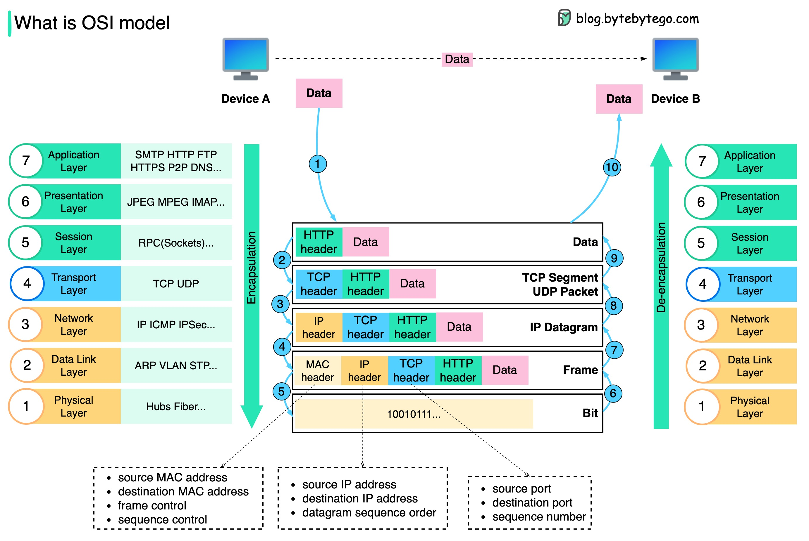

# 🌐 OSI七层模型是什么？数据在网络中怎么传输？

> 一张图看懂数据从发送到接收的封装与解封装全过程

面试必问：OSI模型有几层？数据怎么传的？👇

📌 **为什么需要分层？**
- 每一层只关注**自己的职责**
- 每层根据头部信息处理数据，不需要理解上层数据的含义
- 分层让网络协议**模块化**，更容易维护和扩展

🔄 **数据发送过程（封装）：**

1️⃣ **应用层** — 设备A通过HTTP协议发送数据，加上**HTTP头部**
2️⃣ **传输层** — 加上**TCP/UDP头部**，封装成TCP段（包含源端口、目标端口、序列号）
3️⃣ **网络层** — 加上**IP头部**（包含源/目标IP地址）
4️⃣ **数据链路层** — 加上**MAC头部**（包含源/目标MAC地址）
5️⃣ **物理层** — 封装好的帧以**二进制比特流**在网络上传输

📥 **数据接收过程（解封装）：**

6️⃣-🔟 设备B收到比特流后，**逐层剥离头部**
- 物理层 → 数据链路层 → 网络层 → 传输层 → 应用层
- 最终还原出原始数据

💡 简单理解：发送就像**套信封**，一层套一层；接收就像**拆信封**，一层拆一层。每层只看自己那层的"信封"信息。

你能说出OSI七层分别是什么吗？评论区见！👇

---

#OSI模型 #网络协议 #计算机网络 #TCP #IP #面试 #后端 #计算机基础
