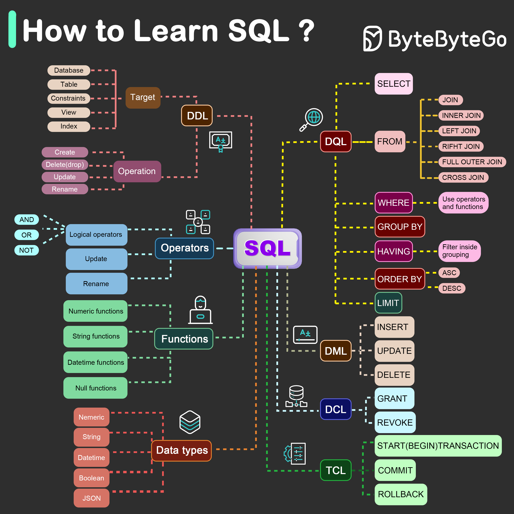

# 📝 SQL怎么学最高效？五大组件一图搞定！

> 1986年成为标准，40年后依然是数据库的王者语言

SQL标准文档那么厚，到底该怎么学？👇

📌 **SQL的五大组件：**

1️⃣ **DDL — 数据定义语言**
- `CREATE` 创建表
- `ALTER` 修改表结构
- `DROP` 删除表
- 定义数据库的"骨架"

2️⃣ **DQL — 数据查询语言**
- `SELECT` 查询数据
- 这是用得**最多**的部分
- 数据分析师重点掌握这个！

3️⃣ **DML — 数据操作语言**
- `INSERT` 插入数据
- `UPDATE` 更新数据
- `DELETE` 删除数据
- 对数据进行增删改

4️⃣ **DCL — 数据控制语言**
- `GRANT` 授权
- `REVOKE` 撤销权限
- 管理数据库的访问控制

5️⃣ **TCL — 事务控制语言**
- `COMMIT` 提交事务
- `ROLLBACK` 回滚事务
- 保证数据的一致性

💡 **学习建议：**
- **后端工程师** → 五大组件都要掌握
- **数据分析师** → 重点学好 **DQL（SELECT查询）**
- 根据自己的角色，**选择最相关的部分**优先学习

SQL从1986年至今已经40年了，依然是关系型数据库的标准语言。学好SQL，走遍天下都不怕！

你学SQL时觉得最难的是什么？JOIN还是子查询？👇

---

#SQL #数据库 #后端开发 #数据分析 #学习路线 #编程 #面试
