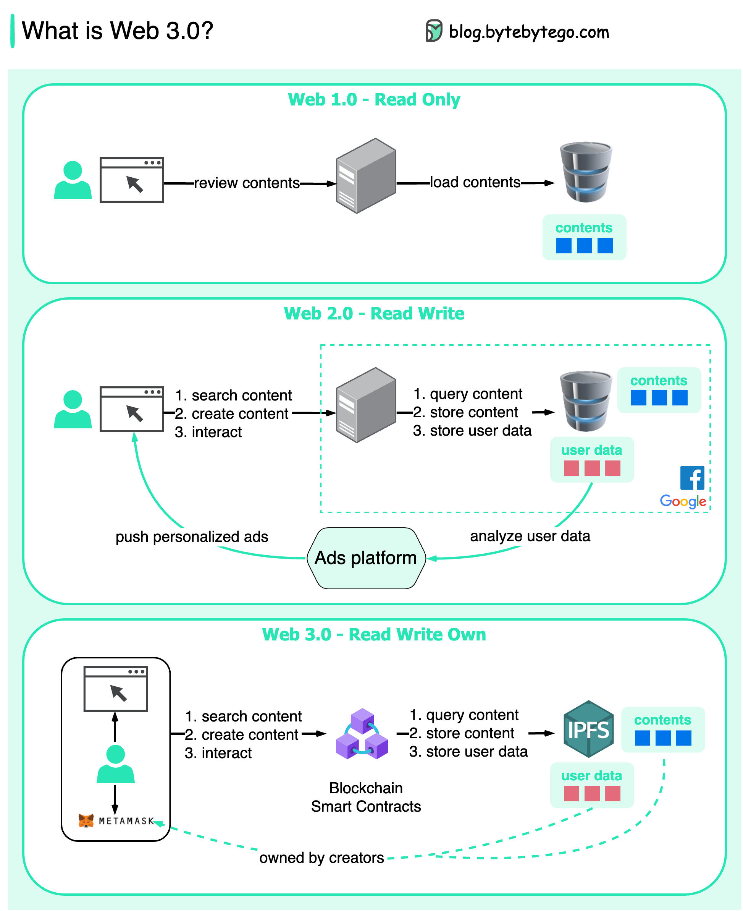

# 🌐 Web 3.0是什么？为什么没有广告？

> 从只读到读写再到读写拥有

Web 的三个时代 👇

📌 **Web 1.0（1991-2004）— 只读**
互联网就像一本目录，静态页面，只能浏览不能互动

📌 **Web 2.0（2004至今）— 读写**
搜索引擎、社交媒体、推荐算法。大公司利用用户数据做广告，这成了主要商业模式。所以说"App比你的朋友更了解你"

📌 **Web 3.0 — 读写拥有**
基于区块链和去中心化应用。内容存在IPFS上，**用户拥有自己的数据**。App要访问数据需要用户授权并付费

💡 Web 3.0 的核心变化是所有权的转移：从平台拥有数据变成用户拥有数据。这可能带来重大创新。

你看好 Web 3.0 吗？👇

---

#Web3 #区块链 #去中心化 #互联网 #科技 #程序员 #未来
