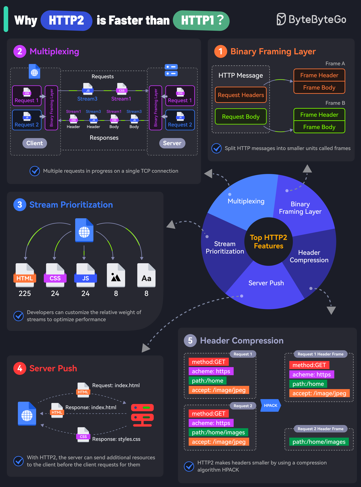

# 🚀 HTTP/2为什么比HTTP/1快？5个关键特性

> 二进制分帧、多路复用、服务器推送、头部压缩……

HTTP/2 快在哪？5个核心特性 👇

📌 **二进制分帧层** — 消息编码为二进制，拆成更小的帧传输，处理更高效
📌 **多路复用** — 一个连接并行处理多个请求响应，帧可以交错传输再重组
📌 **流优先级** — 开发者可以设置请求权重，高优先级的先传
📌 **服务器推送** — 服务器可以主动推送额外资源，不用等客户端请求
📌 **HPACK头部压缩** — 专用压缩算法让多个请求的头部更小，节省带宽

💡 虽然HTTP/2有这些优势，但具体场景下还需要测试和优化才能最大化收益。

你的项目升级到HTTP/2了吗？👇

---

#HTTP2 #性能优化 #Web #多路复用 #后端 #前端 #面试
