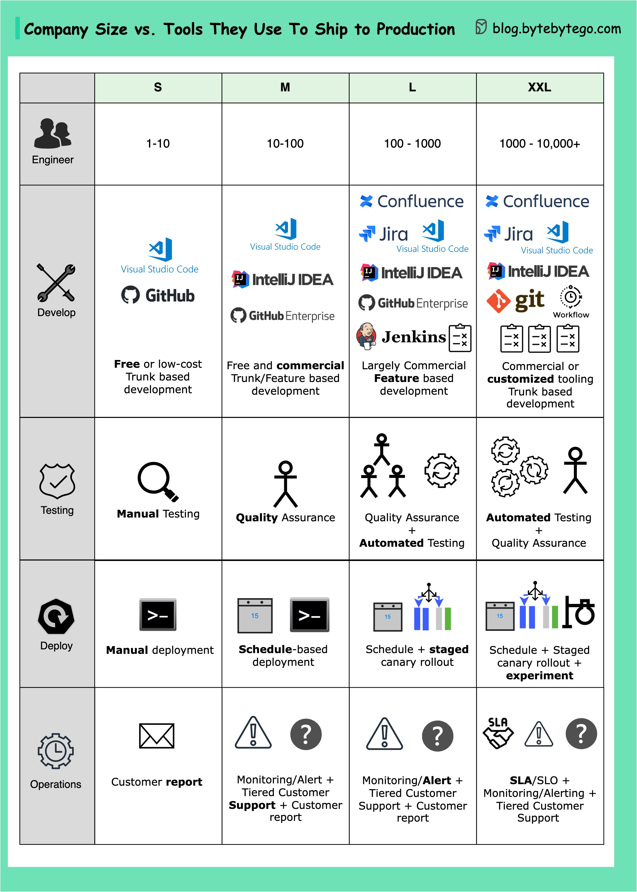

# 🚢 不同规模的团队用什么工具上线？

> 从10人到10000人，工具和流程完全不同

团队规模不同，上线工具和流程也不同 👇

📌 **1-10人** — 专注产品市场匹配，用免费/低成本工具，开发者自己测试部署，关注用户反馈

📌 **10-100人** — 开始规模化，投入关键功能的质量保障，建立定期部署和测试流程，主动建立客户支持

📌 **100-1000人** — 优化工程效率，购买商业工具（如Atlassian），引入标准化和自动化

📌 **1000-10000+人** — 大厂自建实验工具和自动化，如Netflix的"生产环境测试"策略

💡 没有一刀切的方案，工具选择要匹配团队规模和发展阶段。

你们团队多大？用什么工具上线？👇

---

#DevOps #上线 #工具 #团队 #CI/CD #程序员 #效率
