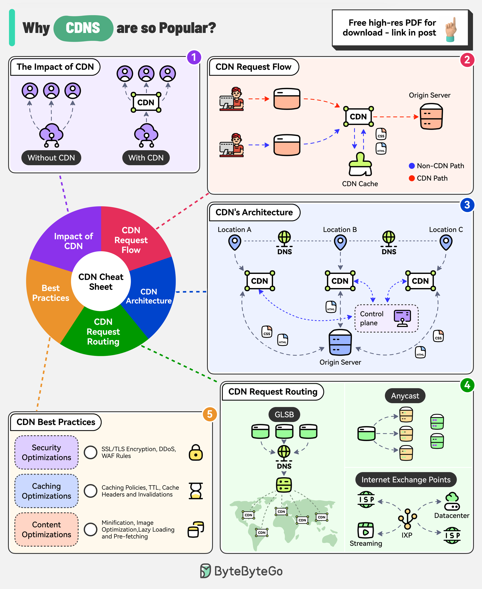

# 🌍 CDN为什么这么火？2028年市场将达380亿美元

> 降低延迟、提升可用性、节省带宽

CDN 市场预计2028年达到380亿美元，为什么这么受欢迎？👇

📌 **CDN的价值** — 提升性能、增加可用性、优化带宽成本、显著降低延迟

📌 **请求流程：**
1. 用户请求到达边缘服务器
2. 缓存命中 → 直接返回
3. 缓存未命中 → 回源获取 → 缓存一份 → 返回给用户

📌 **架构组件：**
- Origin Server（源站）、Edge Servers（边缘节点）、DNS、Control Plane

📌 **路由方式：**
- GSLB（全局负载均衡）、Anycast DNS、IXP（互联网交换点）

💡 Akamai、Cloudflare、CloudFront 是三大CDN玩家。几乎所有面向用户的网站都在用CDN。

你们用的哪家CDN？👇

---

#CDN #性能优化 #Cloudflare #AWS #系统设计 #后端 #架构
