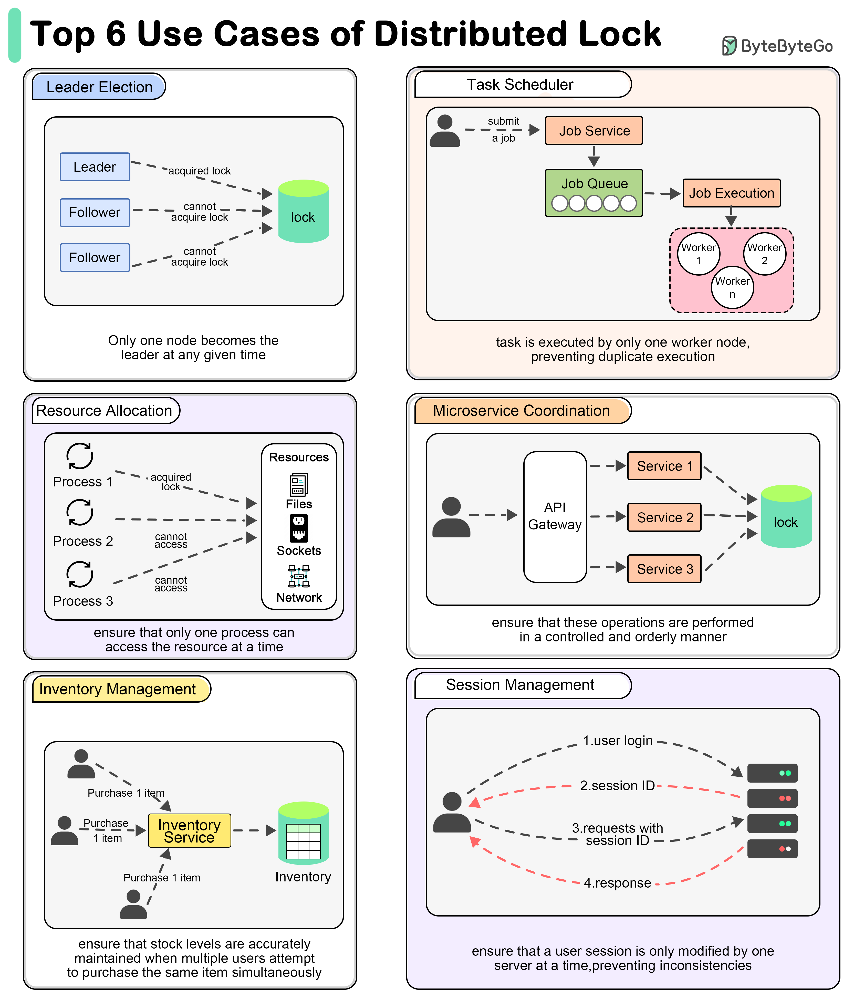

# 🔐 为什么需要分布式锁？6大使用场景

> 领导者选举、任务调度、库存管理……

分布式锁确保分布式系统中的互斥访问，6大场景 👇

📌 **领导者选举** — 确保同一时间只有一个节点成为Leader
📌 **任务调度** — 确保定时任务只被一个Worker执行
📌 **资源分配** — 共享资源（文件系统、网络端口）同一时间只被一个进程访问
📌 **微服务协调** — 多个微服务协调更新不同数据库时保证有序
📌 **库存管理** — 多用户同时购买同一商品时准确维护库存
📌 **Session管理** — 确保用户Session同一时间只被一台服务器修改

💡 常用实现：Redis（Redlock）、ZooKeeper、etcd。Redis最简单但要注意时钟漂移问题。

你用过哪种分布式锁？👇

---

#分布式锁 #Redis #ZooKeeper #分布式 #系统设计 #后端 #面试
