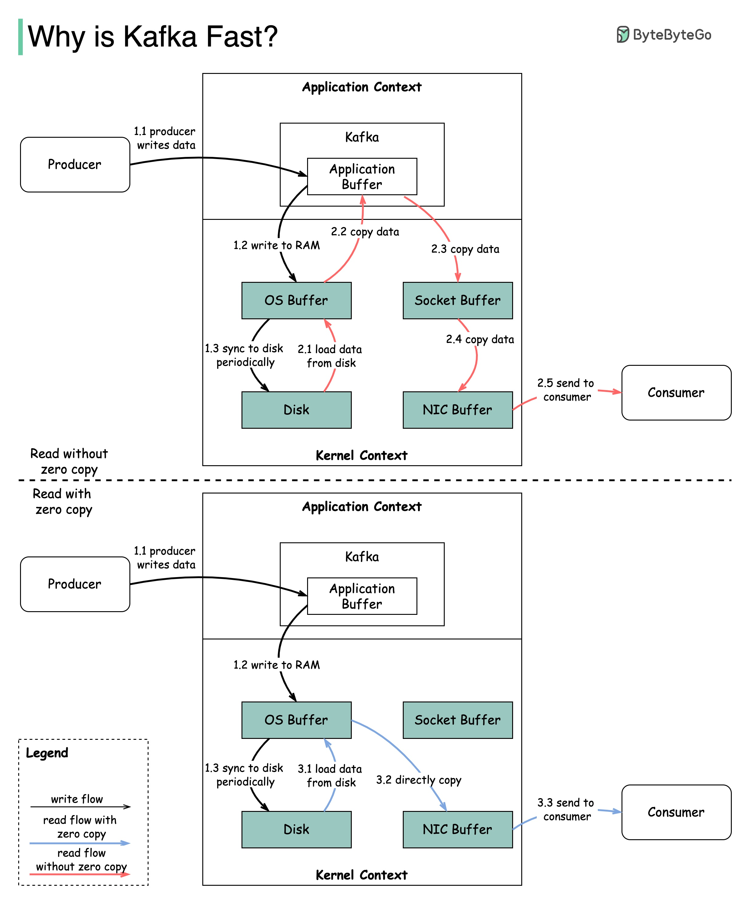

# ⚡ Kafka为什么这么快？两个核心设计

> 顺序IO + 零拷贝，简单但威力巨大

Kafka 的高性能主要靠两个设计 👇

📌 **顺序I/O**
Kafka 依赖顺序读写磁盘，而不是随机读写。顺序IO的速度接近内存

📌 **零拷贝（Zero Copy）**
- ❌ 没有零拷贝：磁盘→OS缓存→Kafka应用→Socket缓冲→网卡→消费者（4次拷贝）
- ✅ 有零拷贝：磁盘→OS缓存→网卡→消费者（通过sendfile()直接传输，省掉中间拷贝）

💡 零拷贝省掉了应用层和内核层之间的多次数据拷贝，这是Kafka吞吐量远超其他消息队列的关键原因。

你知道还有哪些系统用了零拷贝技术？👇

---

#Kafka #性能 #零拷贝 #消息队列 #系统设计 #后端 #面试
